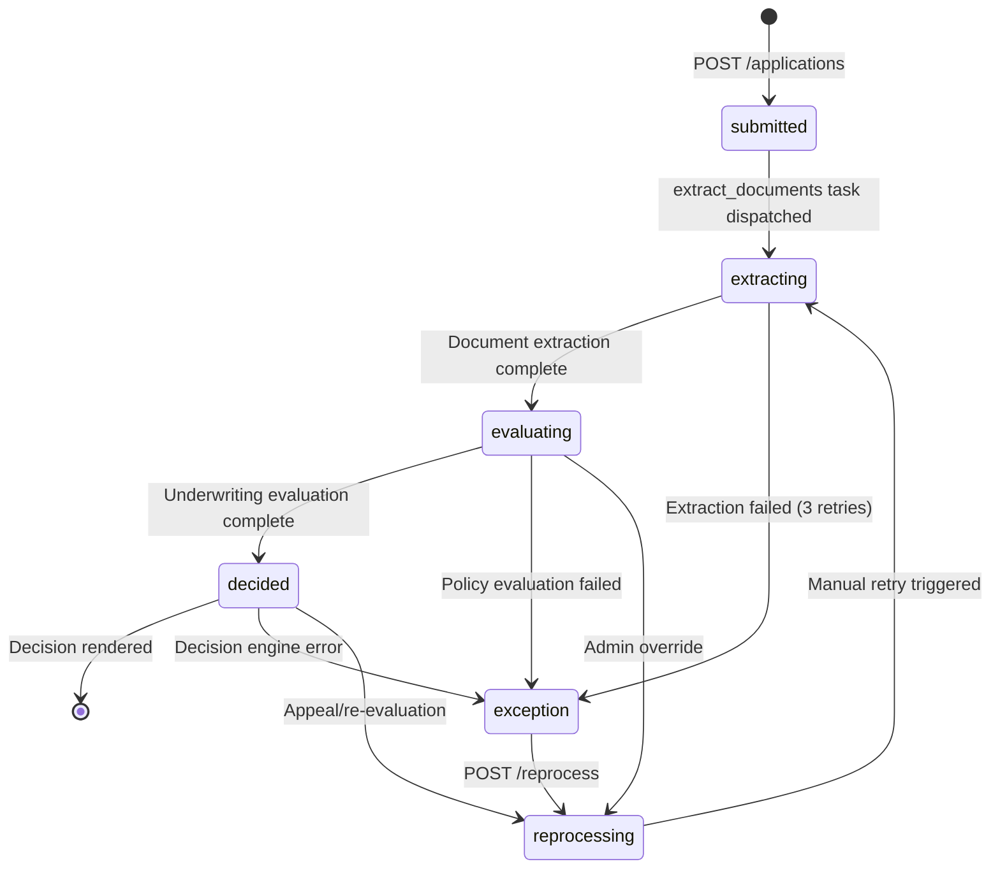

# Orchestrator Service
Model: kimi-k2-thinking:cloud (complexity: reasoning)
Project: Canadian Mortgage Underwriting

# Orchestrator Service Design Plan

**Module Path**: `docs/design/orchestrator-service.md`  
**Module Identifier**: `ORCHESTRATOR`  
**Last Updated**: 2024-01-15

---

## 1. Endpoints

### `POST /api/v1/applications`
Submit a new mortgage application with borrower details, financials, and supporting documents.

**Authentication**: `authenticated` (borrower or lender role)  
**Request Schema** (multipart/form-data):
```python
{
  "borrower_json": str,  # JSON string containing:
  # {
  #   "full_name": str,  # Required
  #   "sin": str,  # Required, 9 digits, will be hashed/encrypted
  #   "date_of_birth": date,  # Required, ISO 8601, will be encrypted
  #   "employment_type": str,  # Required: "salaried", "self_employed", "contract"
  #   "gross_annual_income": Decimal,  # Required, > 0
  #   "monthly_liability_payments": Decimal,  # Optional, default 0
  #   "credit_score": int  # Optional, 300-900
  # },
  "property_value": Decimal,  # Required, > 0
  "purchase_price": Decimal,  # Required, > 0
  "mortgage_amount": Decimal,  # Required, > 0
  "contract_interest_rate": Decimal,  # Required, > 0 (e.g., 5.25)
  "lender_id": UUID,  # Required
  "documents": List[UploadFile]  # Required, PDF/JPG/PNG, max 10 files, 10MB each
}
```

**Response Schema** (201 Created):
```python
{
  "application_id": UUID,
  "borrower_id": UUID,
  "status": str,  # "submitted"
  "created_at": datetime,
  "pipeline_task_id": str  # Celery task ID for tracking
}
```

**Error Responses**:
| HTTP Status | Error Code | Detail |
|-------------|------------|--------|
| `400` | `ORCHESTRATOR_003` | "borrower_json: Invalid JSON format" |
| `400` | `ORCHESTRATOR_005` | "Document upload failed: {s3_error}" |
| `401` | `AUTH_001` | "Missing or invalid authentication token" |
| `403` | `ORCHESTRATOR_009` | "Access denied: insufficient permissions" |
| `413` | `ORCHESTRATOR_010` | "Payload too large: max 100MB total" |
| `422` | `ORCHESTRATOR_003` | "sin: Must be 9 digits" |
| `422` | `ORCHESTRATOR_003` | "credit_score: Must be between 300-900" |
| `422` | `ORCHESTRATOR_003` | "property_value: Must be greater than 0" |

---

### `GET /api/v1/applications/{id}`
Retrieve full application details, underwriting results, and decision.

**Authentication**: `authenticated` (owner, lender, or admin)  
**Path Parameter**: `id: UUID`  

**Response Schema** (200 OK):
```python
{
  "application_id": UUID,
  "status": str,  # ENUM: submitted, extracting, evaluating, decided, exception, reprocessing
  "borrower": {
    "borrower_id": UUID,
    "full_name": str,
    "employment_type": str,
    "gross_annual_income": Decimal,
    "credit_score": int,
    "created_at": datetime
    # Note: sin_hash, sin_encrypted, dob_encrypted never returned
  },
  "property_value": Decimal,
  "purchase_price": Decimal,
  "mortgage_amount": Decimal,
  "contract_interest_rate": Decimal,
  "qualifying_rate": Decimal,  # OSFI stress test rate
  "gds_ratio": Decimal,  # Gross Debt Service ratio
  "tds_ratio": Decimal,  # Total Debt Service ratio
  "cmhc_insurance_required": bool,
  "cmhc_premium_amount": Decimal,
  "cmhc_premium_rate": Decimal,
  "decision": str,  # approved, denied, conditional, pending
  "decision_reason": str,
  "decision_at": datetime,
  "documents": List[{
    "document_id": UUID,
    "document_type": str,
    "file_name": str,
    "file_size": int,
    "uploaded_at": datetime,
    "s3_key": str  # For internal use, not exposed to frontend
  }],
  "lender_id": UUID,
  "created_at": datetime,
  "updated_at": datetime,
  "created_by": UUID
}
```

**Error Responses**:
| HTTP Status | Error Code | Detail |
|-------------|------------|--------|
| `401` | `AUTH_001` | "Missing or invalid authentication token" |
| `403` | `ORCHESTRATOR_009` | "Access denied to application {id}" |
| `404` | `ORCHESTRATOR_001` | "Application {id} not found" |

---

### `GET /api/v1/applications/{id}/documents`
List all uploaded documents for an application.

**Authentication**: `authenticated` (owner, lender, or admin)  
**Path Parameter**: `id: UUID`  

**Response Schema** (200 OK):
```python
{
  "application_id": UUID,
  "documents": List[{
    "document_id": UUID,
    "document_type": str,  # pay_stub, t4, bank_statement, photo_id, etc.
    "file_name": str,
    "file_size": int,
    "mime_type": str,
    "uploaded_at": datetime,
    "download_url": str  # Pre-signed S3 URL, expires in 300s
  }]
}
```

**Error Responses**:
| HTTP Status | Error Code | Detail |
|-------------|------------|--------|
| `401` | `AUTH_001` | "Missing or invalid authentication token" |
| `403` | `ORCHESTRATOR_009` | "Access denied to application {id}" |
| `404` | `ORCHESTRATOR_001` | "Application {id} not found" |

---

### `POST /api/v1/applications/{id}/reprocess`
Manually trigger reprocessing of a failed or stalled application.

**Authentication**: `authenticated` (underwriter or admin role)  
**Path Parameter**: `id: UUID`  
**Request Schema**:
```python
{
  "reason": str,  # Required, min 10 chars
  "priority": str,  # Optional: "normal" (default) or "high"
  "reset_documents": bool  # Optional: re-upload documents, default false
}
```

**Response Schema** (202 Accepted):
```python
{
  "application_id": UUID,
  "old_status": str,
  "new_status": str,  # "reprocessing"
  "reprocess_task_id": str,
  "estimated_completion": datetime
}
```

**Error Responses**:
| HTTP Status | Error Code | Detail |
|-------------|------------|--------|
| `400` | `ORCHESTRATOR_003` | "reason: Must be at least 10 characters" |
| `401` | `AUTH_001` | "Missing or invalid authentication token" |
| `403` | `ORCHESTRATOR_009` | "Access denied: admin or underwriter role required" |
| `404` | `ORCHESTRATOR_001` | "Application {id} not found" |
| `409` | `ORCHESTRATOR_004` | "Application {id} is already processing" |
| `422` | `ORCHESTRATOR_003` | "priority: Must be 'normal' or 'high'" |

---

### `GET /api/v1/applications`
List applications with pagination and filtering.

**Authentication**: `authenticated`  
**Query Parameters**:
```python
{
  "page": int,  # Default 1, min 1
  "size": int,  # Default 20, min 1, max 100
  "status": str,  # Optional, filter by status
  "borrower_id": UUID,  # Optional, filter by borrower
  "lender_id": UUID,  # Optional, filter by lender
  "created_after": datetime,  # Optional, ISO 8601
  "created_before": datetime  # Optional, ISO 8601
}
```

**Response Schema** (200 OK):
```python
{
  "total": int,
  "page": int,
  "size": int,
  "items": List[{
    "application_id": UUID,
    "status": str,
    "borrower_name": str,
    "property_value": Decimal,
    "mortgage_amount": Decimal,
    "decision": str,
    "created_at": datetime,
    "gds_ratio": Decimal,
    "tds_ratio": Decimal
  }]
}
```

**Error Responses**:
| HTTP Status | Error Code | Detail |
|-------------|------------|--------|
| `401` | `AUTH_001` | "Missing or invalid authentication token" |
| `422` | `ORCHESTRATOR_003` | "page: Must be greater than 0" |

---

### `POST /api/v1/fintrac/applications/{id}/verify-identity`
Submit identity verification results for FINTRAC compliance.

**Authentication**: `authenticated` (underwriter or admin)  
**Path Parameter**: `id: UUID`  
**Request Schema**:
```python
{
  "verification_method": str,  # Required: "photo_id", "utility_bill", "bank_statement"
  "verification_result": str,  # Required: "passed", "failed", "pending"
  "document_ids": List[UUID],  # Required, min 1, references uploaded documents
  "notes": str  # Optional
}
```

**Response Schema** (201 Created):
```python
{
  "verification_id": UUID,
  "application_id": UUID,
  "verification_method": str,
  "verification_result": str,
  "verified_at": datetime,
  "verified_by": UUID
}
```

**Error Responses**:
| HTTP Status | Error Code | Detail |
|-------------|------------|--------|
| `400` | `ORCHESTRATOR_006` | "Identity verification failed: {reason}" |
| `401` | `AUTH_001` | "Missing or invalid authentication token" |
| `403` | `ORCHESTRATOR_009` | "Access denied: underwriter role required" |
| `404` | `ORCHESTRATOR_001` | "Application {id} not found" |
| `409` | `ORCHESTRATOR_011` | "Identity verification already completed" |
| `422` | `ORCHESTRATOR_003` | "verification_method: Invalid value" |

---

### `GET /api/v1/fintrac/applications/{id}/verification`
Retrieve FINTRAC identity verification status.

**Authentication**: `authenticated`  
**Path Parameter**: `id: UUID`  

**Response Schema** (200 OK):
```python
{
  "application_id": UUID,
  "verification": {
    "verification_id": UUID,
    "verification_method": str,
    "verification_result": str,
    "verified_at": datetime,
    "verified_by": UUID,
    "document_ids": List[UUID]
  } | null
}
```

**Error Responses**:
| HTTP Status | Error Code | Detail |
|-------------|------------|--------|
| `401` | `AUTH_001` | "Missing or invalid authentication token" |
| `403` | `ORCHESTRATOR_009` | "Access denied to application {id}" |
| `404` | `ORCHESTRATOR_001` | "Application {id} not found" |

---

### `POST /api/v1/fintrac/applications/{id}/report-transaction`
File a FINTRAC transaction report (e.g., large cash transaction).

**Authentication**: `authenticated` (admin role only)  
**Path Parameter**: `id: UUID`  
**Request Schema**:
```python
{
  "report_type": str,  # Required: "large_cash_transaction", "suspicious_transaction"
  "transaction_amount": Decimal,  # Required, > 0
  "transaction_date": date,  # Required, cannot be future
  "transaction_description": str,  # Required
  "suspicion_indicators": List[str]  # Optional, for suspicious_transaction type
}
```

**Response Schema** (201 Created):
```python
{
  "report_id": UUID,
  "application_id": UUID,
  "fintrac_reference": str,  # Official FINTRAC filing number
  "filed_at": datetime,
  "transaction_amount": Decimal,
  "report_type": str
}
```

**Error Responses**:
| HTTP Status | Error Code | Detail |
|-------------|------------|--------|
| `400` | `ORCHESTRATOR_007` | "Transaction amount ${amount} below $10,000 threshold" |
| `401` | `AUTH_001` | "Missing or invalid authentication token" |
| `403` | `ORCHESTRATOR_009` | "Access denied: admin role required" |
| `404` | `ORCHESTRATOR_001` | "Application {id} not found" |
| `422` | `ORCHESTRATOR_003` | "transaction_date: Cannot be in the future" |
| `422` | `ORCHESTRATOR_003` | "report_type: Invalid value" |

---

### `GET /api/v1/fintrac/risk-assessment/{client_id}`
Retrieve aggregated risk assessment for a client across all applications.

**Authentication**: `authenticated` (underwriter or admin)  
**Path Parameter**: `client_id: UUID` (borrower_id)  

**Response Schema** (200 OK):
```python
{
  "client_id": UUID,
  "total_applications": int,
  "risk_score": Decimal,  # 0-100, higher is riskier
  "risk_factors": List[str],  # e.g., ["High TDS ratio", "Multiple applications"]
  "fintrac_reports_filed": int,
  "identity_verifications": List[{
    "application_id": UUID,
    "verification_result": str,
    "verified_at": datetime
  }]
}
```

**Error Responses**:
| HTTP Status | Error Code | Detail |
|-------------|------------|--------|
| `401` | `AUTH_001` | "Missing or invalid authentication token" |
| `403` | `ORCHESTRATOR_009` | "Access denied: underwriter role required" |
| `404` | `ORCHESTRATOR_002` | "Borrower {client_id} not found" |

---

## 2. Models & Database

### Table: `orchestrator_applications`
**Table Name**: `orchestrator_applications`  
**Description**: Core mortgage application tracking with underwriting results

| Column | Type | Constraints | Index | Notes |
|--------|------|-------------|-------|-------|
| `id` | `UUID` | PK | Yes (primary) | Generated v4 |
| `borrower_id` | `UUID` | FK → orchestrator_borrowers.id, NOT NULL | Yes (composite) | |
| `lender_id` | `UUID` | FK → lenders.id, NOT NULL | Yes (composite) | |
| `status` | `VARCHAR(20)` | NOT NULL, CHECK IN ('submitted', 'extracting', 'evaluating', 'decided', 'exception', 'reprocessing') | Yes | |
| `property_value` | `DECIMAL(12,2)` | NOT NULL | No | |
| `purchase_price` | `DECIMAL(12,2)` | NOT NULL | No | |
| `mortgage_amount` | `DECIMAL(12,2)` | NOT NULL | No | |
| `contract_interest_rate` | `DECIMAL(5,2)` | NOT NULL | No | From application |
| `qualifying_rate` | `DECIMAL(5,2)` | NULL | No | OSFI stress test rate |
| `gds_ratio` | `DECIMAL(5,2)` | NULL, CHECK (gds_ratio <= 39.00) | Yes | Gross Debt Service |
| `tds_ratio` | `DECIMAL(5,2)` | NULL, CHECK (tds_ratio <= 44.00) | Yes | Total Debt Service |
| `cmhc_insurance_required` | `BOOLEAN` | NULL | No | |
| `cmhc_premium_amount` | `DECIMAL(12,2)` | NULL | No | |
| `cmhc_premium_rate` | `DECIMAL(5,2)` | NULL | No | |
| `decision` | `VARCHAR(20)` | NULL, CHECK IN ('approved', 'denied', 'conditional', 'pending') | Yes | |
| `decision_reason` | `TEXT` | NULL | No | |
| `decision_at` | `TIMESTAMP` | NULL | Yes | |
| `created_at` | `TIMESTAMP` | NOT NULL, DEFAULT NOW() | Yes (composite) | |
| `updated_at` | `TIMESTAMP` | NOT NULL, DEFAULT NOW() | No | Auto-updated |
| `created_by` | `UUID` | FK → users.id, NOT NULL | Yes | Audit trail |

**Indexes**:
- `idx_applications_lender_status_created` (lender_id, status, created_at DESC)
- `idx_applications_borrower_status` (borrower_id, status)
- `idx_applications_status_decision` (status, decision)
- `idx_applications_created_at` (created_at DESC)

---

### Table: `orchestrator_borrowers`
**Table Name**: `orchestrator_borrowers`  
**Description**: Borrower PII with encryption and hashed SIN for lookups

| Column | Type | Constraints | Index | Notes |
|--------|------|-------------|-------|-------|
| `id` | `UUID` | PK | Yes (primary) | |
| `full_name` | `VARCHAR(255)` | NOT NULL | No | |
| `sin_hash` | `CHAR(64)` | NOT NULL, UNIQUE | Yes | SHA256 hex digest |
| `sin_encrypted` | `BYTEA` | NOT NULL | No | AES-256-GCM encrypted |
| `date_of_birth_encrypted` | `BYTEA` | NOT NULL | No | AES-256-GCM encrypted |
| `employment_type` | `VARCHAR(20)` | NOT NULL, CHECK IN ('salaried', 'self_employed', 'contract') | Yes | |
| `gross_annual_income` | `DECIMAL(12,2)` | NOT NULL, CHECK > 0 | No | |
| `monthly_liability_payments` | `DECIMAL(10,2)` | NOT NULL, DEFAULT 0 | No | For TDS |
| `credit_score` | `INTEGER` | NULL, CHECK BETWEEN 300 AND 900 | Yes | |
| `created_at` | `TIMESTAMP` | NOT NULL, DEFAULT NOW() | Yes | |
| `updated_at` | `TIMESTAMP` | NOT NULL, DEFAULT NOW() | No | |

**Indexes**:
- `idx_borrowers_sin_hash` (sin_hash) - For secure lookups
- `idx_borrowers_credit_score` (credit_score) - For risk assessment queries

---

### Table: `orchestrator_documents`
**Table Name**: `orchestrator_documents`  
**Description**: Document metadata and S3 location tracking

| Column | Type | Constraints | Index | Notes |
|--------|------|-------------|-------|-------|
| `id` | `UUID` | PK | Yes (primary) | |
| `application_id` | `UUID` | FK → orchestrator_applications.id, NOT NULL | Yes (composite) | |
| `document_type` | `VARCHAR(50)` | NOT NULL, CHECK IN ('pay_stub', 't4', 'bank_statement', 'photo_id', 'utility_bill', 'employment_letter', 'other') | Yes | |
| `file_name` | `VARCHAR(255)` | NOT NULL | No | Original filename |
| `s3_bucket` | `VARCHAR(100)` | NOT NULL | No | |
| `s3_key` | `VARCHAR(500)` | NOT NULL, UNIQUE | Yes | UUID-based path |
| `file_size` | `INTEGER` | NOT NULL, CHECK > 0 | No | Bytes |
| `mime_type` | `VARCHAR(100)` | NOT NULL | No | application/pdf, image/jpeg, etc. |
| `uploaded_at` | `TIMESTAMP` | NOT NULL, DEFAULT NOW() | No | |
| `created_at` | `TIMESTAMP` | NOT NULL, DEFAULT NOW() | Yes | |

**Indexes**:
- `idx_documents_app_type` (application_id, document_type)

---

### Table: `orchestrator_audit_logs`
**Table Name**: `orchestrator_audit_logs`  
**Description**: Immutable audit trail for FINTRAC/OSFI compliance

| Column | Type | Constraints | Index | Notes |
|--------|------|-------------|-------|-------|
| `id` | `UUID` | PK | Yes (primary) | |
| `application_id` | `UUID` | FK → orchestrator_applications.id, NOT NULL | Yes (composite) | |
| `event_type` | `VARCHAR(50)` | NOT NULL | Yes | 'status_change', 'decision', 'verification', 'fintrac_report', 'error' |
| `event_data` | `JSONB` | NOT NULL | Yes | Immutable event payload (no PII) |
| `user_id` | `UUID` | FK → users.id, NULL (system events) | No | |
| `ip_address` | `INET` | NULL | Yes | FINTRAC requirement |
| `created_at` | `TIMESTAMP` | NOT NULL, DEFAULT NOW() | Yes (composite) | |

**Indexes**:
- `idx_audit_logs_app_created` (application_id, created_at DESC)
- `idx_audit_logs_event_type` (event_type, created_at)

**Note**: Table has `INSERT` and `SELECT` privileges only. No `UPDATE` or `DELETE` for any role.

---

### Table: `orchestrator_celery_tasks`
**Table Name**: `orchestrator_celery_tasks`  
**Description**: Track async pipeline task execution for observability and retry logic

| Column | Type | Constraints | Index | Notes |
|--------|------|-------------|-------|-------|
| `id` | `UUID` | PK | Yes (primary) | |
| `application_id` | `UUID` | FK → orchestrator_applications.id, NOT NULL | Yes (composite) | |
| `task_name` | `VARCHAR(100)` | NOT NULL | Yes | 'extract_documents', 'evaluate_policy', 'run_decision' |
| `celery_task_id` | `VARCHAR(255)` | NULL, UNIQUE | Yes | Celery's internal task ID |
| `status` | `VARCHAR(20)` | NOT NULL, CHECK IN ('pending', 'running', 'success', 'failure', 'retry') | Yes | |
| `retries` | `INTEGER` | NOT NULL, DEFAULT 0 | No | |
| `result` | `JSONB` | NULL | No | Task output |
| `error_message` | `TEXT` | NULL | No | Truncated at 1000 chars (no PII) |
| `started_at` | `TIMESTAMP` | NULL | Yes | |
| `completed_at` | `TIMESTAMP` | NULL | No | |
| `created_at` | `TIMESTAMP` | NOT NULL, DEFAULT NOW() | Yes | |

**Indexes**:
- `idx_celery_tasks_celery_id` (celery_task_id) - For Celery event tracking
- `idx_celery_tasks_app_status` (application_id, status)

---

### Table: `orchestrator_fintrac_verifications`
**Table Name**: `orchestrator_fintrac_verifications`  
**Description**: FINTRAC identity verification records (immutable)

| Column | Type | Constraints | Index | Notes |
|--------|------|-------------|-------|-------|
| `id` | `UUID` | PK | Yes (primary) | |
| `application_id` | `UUID` | FK → orchestrator_applications.id, NOT NULL, UNIQUE | Yes | One per application |
| `verification_method` | `VARCHAR(50)` | NOT NULL | No | |
| `verification_result` | `VARCHAR(20)` | NOT NULL, CHECK IN ('passed', 'failed', 'pending') | Yes | |
| `verified_at` | `TIMESTAMP` | NOT NULL | Yes | |
| `verified_by` | `UUID` | FK → users.id, NOT NULL | No | |
| `created_at` | `TIMESTAMP` | NOT NULL, DEFAULT NOW() | Yes | |

**Indexes**:
- `idx_fintrac_verifications_app` (application_id)

**Note**: Immutable after creation. No updates allowed.

---

### Table: `orchestrator_fintrac_reports`
**Table Name**: `orchestrator_fintrac_reports`  
**Description**: FINTRAC filed transaction reports (immutable, 5-year retention)

| Column | Type | Constraints | Index | Notes |
|--------|------|-------------|-------|-------|
| `id` | `UUID` | PK | Yes (primary) | |
| `application_id` | `UUID` | FK → orchestrator_applications.id, NOT NULL | Yes (composite) | |
| `report_type` | `VARCHAR(50)` | NOT NULL, CHECK IN ('large_cash_transaction', 'suspicious_transaction') | Yes | |
| `transaction_amount` | `DECIMAL(12,2)` | NOT NULL, CHECK > 0 | Yes | |
| `transaction_date` | `DATE` | NOT NULL | Yes | |
| `transaction_description` | `TEXT` | NOT NULL | No | |
| `suspicion_indicators` | `JSONB` | NULL | No | Array of strings |
| `filed_at` | `TIMESTAMP` | NOT NULL, DEFAULT NOW() | Yes | |
| `filed_by` | `UUID` | FK → users.id, NOT NULL | No | |
| `fintrac_reference` | `VARCHAR(100)` | NULL | Yes | FINTRAC confirmation number |
| `created_at` | `TIMESTAMP` | NOT NULL, DEFAULT NOW() | Yes | |

**Indexes**:
- `idx_fintrac_reports_amount_date` (transaction_amount, transaction_date)
- `idx_fintrac_reports_app` (application_id)

**Note**: Table has row-level security for 5-year retention policy. No deletion before 5 years.

---

## 3. Business Logic

### Pipeline Flow & State Machine



**State Transition Rules**:
- `submitted` → `extracting`: Automatic after successful document upload and Celery task dispatch
- `extracting` → `evaluating`: Triggered by Celery `extract_documents` task success
- `evaluating` → `decided`: Triggered by Celery `evaluate_policy` task success
- Any state → `exception`: Triggered by task failure after max retries or unhandled error
- `exception` → `reprocessing`: Only via manual `POST /reprocess` endpoint (admin/underwriter)
- `reprocessing` → `extracting`: Resets pipeline, optionally re-uploads documents

### Algorithm Specifications

#### OSFI B-20 Stress Test Calculation
```python
def calculate_qualifying_rate(contract_rate: Decimal) -> Decimal:
    """OSFI Guideline B-20: qualifying_rate = max(contract_rate + 2%, 5.25%)"""
    stress_test_rate = contract_rate + Decimal('2.00')
    floor_rate = Decimal('5.25')
    qualifying_rate = max(stress_test_rate, floor_rate)
    
    # Audit log with correlation_id
    logger.info(
        "osfi_stress_test_calculated",
        contract_rate=contract_rate,
        qualifying_rate=qualifying_rate,
        correlation_id=correlation_id
    )
    return qualifying_rate

def calculate_gds_tds(
    mortgage_amount: Decimal,
    qualifying_rate: Decimal,
    property_tax_monthly: Decimal,
    heating_cost_monthly: Decimal,
    gross_monthly_income: Decimal,
    other_debt_payments: Decimal
) -> tuple[Decimal, Decimal]:
    """Calculate GDS/TDS ratios with OSFI limits"""
    # 25-year amortization, monthly payments
    amortization_months = 25 * 12
    monthly_mortgage_payment = calculate_mortgage_payment(
        mortgage_amount, qualifying_rate, amortization_months
    )
    
    gds_numerator = monthly_mortgage_payment + property_tax_monthly + heating_cost_monthly
    tds_numerator = gds_numerator + other_debt_payments
    
    gds_ratio = (gds_numerator / gross_monthly_income) * 100
    tds_ratio = (tds_numerator / gross_monthly_income) * 100
    
    # Hard limits enforcement
    if gds_ratio > Decimal('39.00'):
        raise ApplicationBusinessRuleError(
            f"GDS ratio {gds_ratio:.2f}% exceeds OSFI limit of 39%"
        )
    if tds_ratio > Decimal('44.00'):
        raise ApplicationBusinessRuleError(
            f"TDS ratio {tds_ratio:.2f}% exceeds OSFI limit of 44%"
        )
    
    return round(gds_ratio, 2), round(tds_ratio, 2)
```

#### CMHC Insurance Premium Calculation
```python
def calculate_cmhc_premium(mortgage_amount: Decimal, property_value: Decimal) -> tuple[bool, Decimal, Decimal]:
    """CMHC insurance requirement and premium tier lookup"""
    ltv = (mortgage_amount / property_value) * 100
    
    if ltv <= Decimal('80.00'):
        return False, Decimal('0.00'), Decimal('0.00')
    
    # Premium tiers (LTV > 80%)
    if Decimal('80.01') <= ltv <= Decimal('85.00'):
        premium_rate = Decimal('2.80')
    elif Decimal('85.01') <= ltv <= Decimal('90.00'):
        premium_rate = Decimal('3.10')
    elif Decimal('90.01') <= ltv <= Decimal('95.00'):
        premium_rate = Decimal('4.00')
    else:
        raise ApplicationBusinessRuleError(f"LTV {ltv:.2f}% exceeds maximum 95%")
    
    premium_amount = mortgage_amount * premium_rate / Decimal('100')
    return True, round(premium_amount, 2), premium_rate
```

#### FINTRAC Reporting Trigger
```python
def check_fintrac_reporting_requirement(application_id: UUID, transaction_amount: Decimal) -> bool:
    """Trigger FINTRAC report for transactions > CAD $10,000"""
    threshold = Decimal('10000.00')
    
    if transaction_amount > threshold:
        # Log immutable audit record
        audit_log(
            application_id=application_id,
            event_type='fintrac_threshold_exceeded',
            event_data={'transaction_amount': str(transaction_amount)},
            user_id=current_user.id,
            ip_address=client_ip
        )
        return True
    return False
```

### Validation Rules

| Field | Validation Rule | Error Code |
|-------|-----------------|------------|
| `sin` | 9 digits, numeric only, Luhn algorithm optional | `ORCHESTRATOR_003` |
| `date_of_birth` | Must be at least 18 years old, not in future | `ORCHESTRATOR_003` |
| `gross_annual_income` | > CAD $30,000 (configurable via config.py) | `ORCHESTRATOR_003` |
| `credit_score` | 300-900 range, or NULL if not provided | `ORCHESTRATOR_003` |
| `property_value` | Must be ≥ purchase_price ≥ mortgage_amount | `ORCHESTRATOR_003` |
| `documents` | Max 10 files, 10MB each, MIME type in whitelist | `ORCHESTRATOR_005` |
| `contract_interest_rate` | > 0% and < 20% (usury check) | `ORCHESTRATOR_003` |

---

## 4. Migrations

### New Tables (Alembic Revision: `orchestrator_initial`)
```python
# revision: orchestrator_initial
# depends_on: base

def upgrade():
    # Create all tables defined in Models section
    create_table('orchestrator_applications', ...)
    create_table('orchestrator_borrowers', ...)
    create_table('orchestrator_documents', ...)
    create_table('orchestrator_audit_logs', ...)
    create_table('orchestrator_celery_tasks', ...)
    create_table('orchestrator_fintrac_verifications', ...)
    create_table('orchestrator_fintrac_reports', ...)
    
    # Create indexes
    create_index('idx_applications_lender_status_created', ...)
    create_index('idx_applications_borrower_status', ...)
    create_index('idx_applications_status_decision', ...)
    create_index('idx_borrowers_sin_hash', ...)
    create_index('idx_documents_app_type', ...)
    create_index('idx_audit_logs_app_created', ...)
    create_index('idx_celery_tasks_celery_id', ...)
    create_index('idx_fintrac_reports_amount_date', ...)
    
    # Grant permissions (read-only for audit_logs)
    op.execute("GRANT SELECT, INSERT ON orchestrator_audit_logs TO app_user;")
    op.execute("REVOKE UPDATE, DELETE ON orchestrator_audit_logs FROM app_user;")
    
    # Set up 5-year retention policy for fintrac_reports (PostgreSQL 15+)
    op.execute("""
        ALTER TABLE orchestrator_fintrac_reports 
        SET (autovacuum_enabled = false);
    """)
```

### Data Migration Needs
- **None** for initial deployment. All tables are new.
- Future migration: If adding new premium tiers, seed via Alembic `op.bulk_insert()`

---

## 5. Security & Compliance

### OSFI B-20 Requirements
1. **Stress Test Enforcement**: `qualifying_rate` calculated in `evaluate_policy` task using `max(contract_rate + 2%, 5.25%)`. Formula logged with correlation_id.
2. **Hard Limits**: Database constraints `CHECK (gds_ratio <= 39.00)` and `CHECK (tds_ratio <= 44.00)` prevent manual override. Business logic raises `ApplicationBusinessRuleError` if exceeded.
3. **Auditability**: Every GDS/TDS calculation creates an `orchestrator_audit_logs` entry with `event_type='ratio_calculated'` and full breakdown in `event_data` (income, payments, rates). Logs retained 7 years.
4. **Immutability**: Once `decision` is set to `approved`/`denied`, cannot be changed. New reprocessing creates new application version (future enhancement).

### FINTRAC Requirements
1. **Immutable Audit Trail**: `orchestrator_audit_logs` table has `INSERT` only privileges. No updates/deletions. All status changes, identity verifications, and transaction reports logged with `ip_address` and `user_id`.
2. **Identity Verification**: `POST /fintrac/applications/{id}/verify-identity` creates immutable record in `orchestrator_fintrac_verifications`. Failed verifications flagged in risk assessment.
3. **Transaction Reporting**: Automatic trigger when `mortgage_amount > 10000`. Admin must manually file report via `POST /fintrac/applications/{id}/report-transaction`. Report stored in `orchestrator_fintrac_reports` with 5-year retention.
4. **5-Year Retention**: PostgreSQL row-level security policy prevents deletion of `orchestrator_fintrac_reports` rows younger than 5 years. Archive to cold storage after 5 years (future enhancement).

### CMHC Requirements
1. **LTV Calculation**: `ltv = mortgage_amount / property_value` using `Decimal` with precision 12,2. No floating-point arithmetic.
2. **Premium Tier Lookup**: Hardcoded tiers in `constants.py`:
   ```python
   CMHC_PREMIUM_TIERS = [
       (Decimal('80.01'), Decimal('85.00'), Decimal('2.80')),
       (Decimal('85.01'), Decimal('90.00'), Decimal('3.10')),
       (Decimal('90.01'), Decimal('95.00'), Decimal('4.00'))
   ]
   ```
3. **Insurance Flag**: `cmhc_insurance_required` boolean set automatically. If `True`, premium added to total loan amount in decision logic.

### PIPEDA Requirements
1. **Encryption at Rest**: `sin_encrypted` and `date_of_birth_encrypted` use AES-256-GCM. Encryption key from `common/security.py::encrypt_pii()` which uses AWS KMS or HashiCorp Vault (key ID from `config.py`).
2. **Hash-Based Lookups**: `sin_hash` is SHA256 of normalized SIN (no dashes, uppercase). Used for duplicate detection and risk assessment queries. Never log hash.
3. **Data Minimization**: Only collect fields required for underwriting. Optional fields: `credit_score`, `monthly_liability_payments`. Reject extraneous fields in Pydantic model.
4. **No PII in Logs**: All log statements must pass through `sanitize_log()` helper that removes SIN, DOB, income, banking data. Error responses never include PII.
5. **Access Control**: Borrowers can only view their own applications. Lenders can only view applications for their institution. Admin role required for FINTRAC reporting.

### Authentication & Authorization Matrix

| Endpoint | Public | Borrower | Lender | Underwriter | Admin |
|----------|--------|----------|--------|-------------|-------|
| `POST /applications` | ❌ | ✅ | ✅ | ✅ | ✅ |
| `GET /applications/{id}` | ❌ | ✅ (own) | ✅ (own lender) | ✅ | ✅ |
| `GET /applications/{id}/documents` | ❌ | ✅ (own) | ✅ (own lender) | ✅ | ✅ |
| `POST /applications/{id}/reprocess` | ❌ | ❌ | ❌ | ✅ | ✅ |
| `GET /applications` | ❌ | ✅ (own) | ✅ (own lender) | ✅ | ✅ |
| `POST /fintrac/.../verify-identity` | ❌ | ❌ | ❌ | ✅ | ✅ |
| `GET /fintrac/.../verification` | ❌ | ❌ | ❌ | ✅ | ✅ |
| `POST /fintrac/.../report-transaction` | ❌ | ❌ | ❌ | ❌ | ✅ |
| `GET /fintrac/risk-assessment/{id}` | ❌ | ❌ | ❌ | ✅ | ✅ |

**JWT Scopes Required**:
- `read:applications` - For GET endpoints
- `write:applications` - For POST /applications
- `admin:fintrac` - For FINTRAC reporting
- `admin:reprocess` - For reprocessing

---

## 6. Error Codes & HTTP Responses

### Exception Hierarchy
```python
# modules/orchestrator/exceptions.py
class OrchestratorException(AppException):
    """Base exception for orchestrator module"""
    pass

class ApplicationNotFoundError(OrchestratorException):
    http_status = 404
    error_code = "ORCHESTRATOR_001"

class BorrowerNotFoundError(OrchestratorException):
    http_status = 404
    error_code = "ORCHESTRATOR_002"

class ApplicationValidationError(OrchestratorException):
    http_status = 422
    error_code = "ORCHESTRATOR_003"

class ApplicationStateError(OrchestratorException):
    http_status = 409
    error_code = "ORCHESTRATOR_004"

class DocumentUploadError(OrchestratorException):
    http_status = 400
    error_code = "ORCHESTRATOR_005"

class FintracVerificationError(OrchestratorException):
    http_status = 422
    error_code = "ORCHESTRATOR_006"

class FintracReportThresholdError(OrchestratorException):
    http_status = 422
    error_code = "ORCHESTRATOR_007"

class TaskRetryExceededError(OrchestratorException):
    http_status = 503
    error_code = "ORCHESTRATOR_008"

class UnauthorizedAccessError(OrchestratorException):
    http_status = 403
    error_code = "ORCHESTRATOR_009"

class PayloadTooLargeError(OrchestratorException):
    http_status = 413
    error_code = "ORCHESTRATOR_010"

class DuplicateVerificationError(OrchestratorException):
    http_status = 409
    error_code = "ORCHESTRATOR_011"
```

### Error Response Format
All errors return JSON with consistent structure:
```json
{
  "detail": "Application 123e4567-e89b-12d3-a456-426614174000 not found",
  "error_code": "ORCHESTRATOR_001",
  "correlation_id": "a1b2c3d4-e5f6-7890-abcd-ef1234567890",
  "timestamp": "2024-01-15T14:30:00Z"
}
```

### Retry & Timeout Configuration

**Celery Task Settings** (`modules/orchestrator/tasks.py`):
```python
# Global Celery configuration
task_serializer = 'json'
result_serializer = 'json'
timezone = 'UTC'
enable_utc = True

# Task-specific settings
@celery_app.task(
    bind=True,
    max_retries=3,
    default_retry_delay=60,  # 1 minute initial
    retry_backoff=True,
    retry_backoff_max=3600,  # Max 1 hour
    retry_jitter=True,
    soft_time_limit=300,  # 5 minutes
    time_limit=360,  # 6 minutes hard limit
    rate_limit='10/m'  # 10 tasks per minute per worker
)
def extract_documents(self, application_id: UUID):
    ...
```

**Timeout Values**:
| Task | Soft Limit | Hard Limit | Max Retries | Backoff |
|------|------------|------------|-------------|---------|
| `extract_documents` | 5 min | 6 min | 3 | Exponential (2^retry * 60s) |
| `evaluate_policy` | 3 min | 4 min | 3 | Exponential (2^retry * 60s) |
| `run_decision` | 2 min | 3 min | 2 | Exponential (2^retry * 60s) |

**Dead Letter Queue**: Failed tasks after max retries are sent to `orchestrator.dlq` queue for manual investigation. DLQ messages retained 30 days.

### Health Check Endpoints
```python
# modules/orchestrator/routes.py
@router.get("/health", tags=["health"])
async def health_check(db: AsyncSession = Depends(get_async_session)):
    """FastAPI service health"""
    await db.execute("SELECT 1")
    return {"status": "healthy", "service": "orchestrator"}

@router.get("/health/celery", tags=["health"])
async def celery_health_check():
    """Celery workers health"""
    inspect = celery_app.control.inspect()
    active = inspect.active()
    if not active:
        raise HTTPException(503, "Celery workers unavailable")
    return {"status": "healthy", "workers": len(active)}

@router.get("/health/s3", tags=["health"])
async def s3_health_check(s3_client = Depends(get_s3_client)):
    """S3/MinIO connectivity"""
    await s3_client.head_bucket(Bucket=config.S3_BUCKET)
    return {"status": "healthy", "bucket": config.S3_BUCKET}

@router.get("/health/db", tags=["health"])
async def db_health_check(db: AsyncSession = Depends(get_async_session)):
    """Database connectivity"""
    result = await db.execute("SELECT version()")
    return {"status": "healthy", "postgres_version": result.scalar()}
```

### Observability Integration

**Logging**: All services use `structlog` with correlation_id propagation:
```python
# In middleware
correlation_id = request.headers.get("X-Correlation-ID", uuid.uuid4().hex)
structlog.contextvars.bind_contextvars(correlation_id=correlation_id)

# In tasks
logger.info(
    "pipeline_task_started",
    task_name="extract_documents",
    application_id=app_id,
    correlation_id=correlation_id
)
```

**Metrics** (Prometheus):
```python
# Counter
applications_total = Counter(
    'orchestrator_applications_total',
    'Total applications by status',
    ['status', 'decision']
)

# Histogram
task_duration_seconds = Histogram(
    'orchestrator_task_duration_seconds',
    'Task execution time',
    ['task_name']
)

# Gauge
pipeline_backlog = Gauge(
    'orchestrator_pipeline_backlog',
    'Applications waiting for processing'
)
```

**Tracing**: OpenTelemetry spans for each Celery task and HTTP request. Spans include `application_id`, `borrower_id` (hashed), `lender_id`.

---

### Additional Implementation Notes

**File Structure**:
```
modules/orchestrator/
├── __init__.py
├── constants.py          # Enums, CMHC tiers, OSFI constants
├── models.py            # SQLAlchemy ORM models
├── schemas.py           # Pydantic v2 DTOs (CreateApplication, ApplicationResponse, etc.)
├── services.py          # Business logic (calculate_gds_tds, check_fintrac_threshold)
├── routes.py            # FastAPI routers
├── tasks.py             # Celery tasks (extract_documents, evaluate_policy, run_decision)
├── exceptions.py        # Exception classes
├── dependencies.py      # get_s3_client, get_celery_app, get_current_user_role
└── utils/
    ├── encryption.py    # encrypt_pii(), decrypt_pii() wrappers
    ├── audit.py         # audit_log() helper
    └── validation.py    # validate_sin(), validate_document_mime()
```

**Environment Variables** (add to `.env.example`):
```bash
# S3/MinIO
S3_ENDPOINT=http://minio:9000
S3_BUCKET=mortgage-documents
S3_ACCESS_KEY=...
S3_SECRET_KEY=...

# Celery
CELERY_BROKER_URL=redis://redis:6379/0
CELERY_RESULT_BACKEND=redis://redis:6379/0
CELERY_TASK_MAX_RETRIES=3

# Encryption
KMS_KEY_ID=arn:aws:kms:...
ENCRYPTION_ALGORITHM=AES-256-GCM

# FINTRAC
FINTRAC_REPORTING_THRESHOLD=10000.00
FINTRAC_RETENTION_YEARS=5
```

**Testing Strategy**:
- **Unit tests**: Mock S3, Celery, database. Test calculation formulas with edge cases (LTV=80.01%, GDS=39% boundary).
- **Integration tests**: Full pipeline with real MinIO, Celery worker, PostgreSQL. Use `@pytest.mark.integration`.
- **Compliance tests**: Verify no PII in logs, encryption works, audit logs immutable, FINTRAC threshold triggers.

**Performance Considerations**:
- Use `asyncpg` connection pooling (min_size=10, max_size=50)
- Celery worker concurrency: `2 * CPU cores`
- S3 pre-signed URLs cached for 5 minutes
- Redis for Celery backend and rate limiting
- Database indexes on all foreign keys and query paths

---

**WARNING**: This design assumes the existence of `lenders` and `users` modules for foreign key relationships. If these modules do not exist, replace FKs with `UUID` columns without constraints and add validation in service layer.