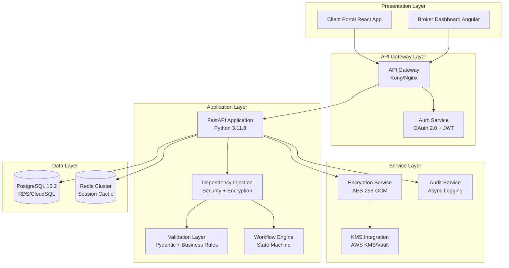

# Design: Client Intake & Application
Model: kimi-k2-thinking:cloud (complexity: reasoning)
Project: Canadian Mortgage Underwriting

# Client Intake & Application Module Architecture

## 1. Architecture Overview



---

## 2. Detailed Database Design

### 2.1 Core Schema with Encryption

```sql
-- Master encryption keys table (never delete, only rotate)
CREATE TABLE encryption_keys (
    id UUID PRIMARY KEY DEFAULT gen_random_uuid(),
    key_id VARCHAR(64) UNIQUE NOT NULL, -- KMS key ID reference
    encrypted_dek BYTEA NOT NULL,       -- Data encryption key (encrypted with KEK)
    created_at TIMESTAMPTZ DEFAULT NOW(),
    rotated_at TIMESTAMPTZ,
    is_active BOOLEAN DEFAULT TRUE
);

-- Clients table with field-level encryption
CREATE TABLE clients (
    id UUID PRIMARY KEY DEFAULT gen_random_uuid(),
    user_id UUID NOT NULL REFERENCES auth_users(id) ON DELETE CASCADE,
    sin_encrypted BYTEA NOT NULL,       -- AES-256-GCM encrypted
    sin_key_id UUID NOT NULL REFERENCES encryption_keys(id),
    sin_nonce BYTEA NOT NULL,           -- 12-byte nonce for GCM
    date_of_birth_encrypted BYTEA NOT NULL,
    dob_key_id UUID NOT NULL REFERENCES encryption_keys(id),
    dob_nonce BYTEA NOT NULL,
    employment_status VARCHAR(50) NOT NULL,
    employer_name VARCHAR(255),
    years_employed DECIMAL(4,1),
    annual_income NUMERIC(12,2) NOT NULL CHECK (annual_income > 0),
    other_income NUMERIC(12,2) DEFAULT 0,
    credit_score INTEGER CHECK (credit_score BETWEEN 300 AND 900),
    marital_status VARCHAR(20),
    created_at TIMESTAMPTZ DEFAULT NOW(),
    updated_at TIMESTAMPTZ DEFAULT NOW()
);

CREATE INDEX idx_clients_user ON clients(user_id);

-- Applications with multi-state workflow
CREATE TYPE application_status AS ENUM (
    'draft', 'in_review', 'underwriting', 
    'approved', 'rejected', 'closed'
);

CREATE TYPE mortgage_type AS ENUM (
    'fixed', 'variable', 'hybrid'
);

CREATE TABLE applications (
    id UUID PRIMARY KEY DEFAULT gen_random_uuid(),
    client_id UUID NOT NULL REFERENCES clients(id) ON DELETE CASCADE,
    broker_id UUID NOT NULL REFERENCES brokers(id),
    application_type VARCHAR(50) DEFAULT 'purchase',
    status application_status DEFAULT 'draft',
    property_address TEXT NOT NULL,
    property_type VARCHAR(50) NOT NULL,
    property_value NUMERIC(12,2) NOT NULL,
    purchase_price NUMERIC(12,2) NOT NULL CHECK (purchase_price > 0),
    down_payment NUMERIC(12,2) NOT NULL,
    requested_loan_amount NUMERIC(12,2) NOT NULL,
    amortization_years INTEGER NOT NULL CHECK (
        (mortgage_type = 'insured' AND amortization_years BETWEEN 5 AND 30) OR
        (mortgage_type != 'insured' AND amortization_years BETWEEN 5 AND 25)
    ),
    term_years INTEGER NOT NULL CHECK (term_years BETWEEN 1 AND 10),
    mortgage_type mortgage_type NOT NULL,
    created_at TIMESTAMPTZ DEFAULT NOW(),
    updated_at TIMESTAMPTZ DEFAULT NOW(),
    submitted_at TIMESTAMPTZ
);

CREATE INDEX idx_applications_client ON applications(client_id);
CREATE INDEX idx_applications_broker ON applications(broker_id);
CREATE INDEX idx_applications_status ON applications(status);

-- Co-borrowers with same encryption strategy
CREATE TABLE co_borrowers (
    id UUID PRIMARY KEY DEFAULT gen_random_uuid(),
    application_id UUID NOT NULL REFERENCES applications(id) ON DELETE CASCADE,
    full_name VARCHAR(255) NOT NULL,
    sin_encrypted BYTEA NOT NULL,
    sin_key_id UUID NOT NULL REFERENCES encryption_keys(id),
    sin_nonce BYTEA NOT NULL,
    annual_income NUMERIC(12,2) NOT NULL CHECK (annual_income > 0),
    employment_status VARCHAR(50),
    credit_score INTEGER CHECK (credit_score BETWEEN 300 AND 900)
);

-- Audit trail for compliance (OSFI/FCAC regulations)
CREATE TABLE audit_logs (
    id UUID PRIMARY KEY DEFAULT gen_random_uuid(),
    entity_type VARCHAR(50) NOT NULL, -- 'application', 'client'
    entity_id UUID NOT NULL,
    action VARCHAR(50) NOT NULL,
    user_id UUID NOT NULL,
    ip_address INET,
    user_agent TEXT,
    changes JSONB, -- Only non-sensitive field changes
    created_at TIMESTAMPTZ DEFAULT NOW()
);

CREATE INDEX idx_audit_entity ON audit_logs(entity_type, entity_id);
```

---

## 3. Security & Encryption Implementation

### 3.1 Custom SQLAlchemy Encrypted Type

```python
# app/core/security/encryption.py
from cryptography.hazmat.primitives.ciphers.aead import AESGCM
from cryptography.hazmat.primitives import hashes
from cryptography.hazmat.primitives.kdf.pbkdf2 import PBKDF2HMAC
import os
import base64
from typing import Optional
from sqlalchemy.types import TypeDecorator, BINARY
from sqlalchemy import UUID

class EncryptedType(TypeDecorator):
    """Transparent AES-256-GCM encryption for PII fields"""
    impl = BINARY
    
    def __init__(self, key_id: str, *args, **kwargs):
        super().__init__(*args, **kwargs)
        self.key_id = key_id
        self.encryption_service = EncryptionService()
    
    def process_bind_param(self, value: Optional[str], dialect):
        if value is None:
            return None
        
        # Generate unique DEK per field instance
        dek = os.urandom(32)
        aesgcm = AESGCM(dek)
        nonce = os.urandom(12)
        
        # Encrypt data
        ciphertext = aesgcm.encrypt(nonce, value.encode('utf-8'), None)
        
        # Encrypt DEK with master KEK from KMS
        kek = self.encryption_service.get_key(self.key_id)
        encrypted_dek = aesgcm.encrypt(nonce, dek, None)
        
        # Store as: nonce + encrypted_dek + ciphertext
        return nonce + encrypted_dek + ciphertext
    
    def process_result_value(self, value: Optional[bytes], dialect):
        if value is None:
            return None
        
        # Extract components
        nonce = value[:12]
        encrypted_dek = value[12:44]
        ciphertext = value[44:]
        
        # Decrypt DEK
        kek = self.encryption_service.get_key(self.key_id)
        dek = AESGCM(kek).decrypt(nonce, encrypted_dek, None)
        
        # Decrypt data
        plaintext = AESGCM(dek).decrypt(nonce, ciphertext, None)
        return plaintext.decode('utf-8')

class EncryptionService:
    def __init__(self, kms_backend: str = "aws"):
        self.kms = KMSFactory.create(kms_backend)
    
    def get_key(self, key_id: str) -> bytes:
        """Retrieve data encryption key from KMS"""
        cache_key = f"dek:{key_id}"
        dek = redis_client.get(cache_key)
        
        if not dek:
            encrypted_dek = db.query(EncryptionKey).filter_by(key_id=key_id).first()
            dek = self.kms.decrypt(encrypted_dek.encrypted_dek)
            redis_client.setex(cache_key, 3600, dek)  # Cache for 1 hour
        
        return dek
```

### 3.2 OAuth 2.0 + JWT Security

```python
# app/core/security/auth.py
from fastapi import Depends, HTTPException, Security
from fastapi.security import HTTPBearer, HTTPAuthorizationCredentials
import jwt
from enum import Enum

class Role(Enum):
    CLIENT = "client"
    BROKER = "broker"
    ADMIN = "admin"

class SecurityRequirements:
    @staticmethod
    def verify_client_access(
        application_id: UUID,
        credentials: HTTPAuthorizationCredentials = Security(HTTPBearer())
    ):
        token = jwt.decode(credentials.credentials, public_key, algorithms=["RS256"])
        
        if token["role"] == Role.CLIENT.value:
            # Verify client owns the application
            app = db.query(Application).join(Client).filter(
                Application.id == application_id,
                Client.user_id == token["sub"]
            ).first()
            
            if not app:
                raise HTTPException(status_code=403, detail="Access denied")
        
        elif token["role"] == Role.BROKER.value:
            # Verify broker is assigned
            app = db.query(Application).filter(
                Application.id == application_id,
                Application.broker_id == token["broker_id"]
            ).first()
            
            if not app:
                raise HTTPException(status_code=403, detail="Access denied")
        
        return token

    @staticmethod
    def mask_sensitive_data(data: dict) -> dict:
        """Remove PII from API responses"""
        data.pop("sin_encrypted", None)
        data.pop("date_of_birth_encrypted", None)
        data.pop("annual_income", None)
        data.pop("other_income", None)
        return data
```

---

## 4. API Endpoint Implementation

### 4.1 FastAPI Router with Security

```python
# app/api/v1/applications.py
from fastapi import APIRouter, Depends, status
from pydantic import BaseModel, Field, validator
from decimal import Decimal
from typing import List, Optional
from uuid import UUID

router = APIRouter(prefix="/applications", tags=["applications"])

# Pydantic models with validation
class ApplicationCreate(BaseModel):
    property_address: str = Field(..., max_length=500)
    property_value: Decimal = Field(..., gt=0)
    purchase_price: Decimal = Field(..., gt=0)
    down_payment: Decimal
    amortization_years: int
    term_years: int = Field(..., ge=1, le=10)
    mortgage_type: str
    
    @validator("amortization_years")
    def validate_amortization(cls, v, values):
        # Check if insured (simplified - would check down payment %)
        is_insured = values.get("down_payment", 0) < values.get("purchase_price", 0) * 0.2
        if is_insured and not (5 <= v <= 30):
            raise ValueError("Insured mortgages: 5-30 years")
        if not is_insured and not (5 <= v <= 25):
            raise ValueError("Uninsured mortgages: 5-25 years")
        return v

class ApplicationResponse(BaseModel):
    id: UUID
    status: str
    property_address: str
    # Income and PII fields EXCLUDED by default
    
    class Config:
        orm_mode = True

@router.post("/", status_code=status.HTTP_201_CREATED)
async def create_application(
    data: ApplicationCreate,
    token: dict = Depends(SecurityRequirements.verify_client_access)
):
    """Create new mortgage application"""
    # Start database transaction
    async with db.transaction():
        # Get client record
        client = await ClientRepository.get_by_user_id(token["sub"])
        
        # Calculate loan amount
        loan_amount = data.purchase_price - data.down_payment
        
        # Create application in DRAFT status
        application = Application(
            client_id=client.id,
            broker_id=client.assigned_broker_id,
            status="draft",
            requested_loan_amount=loan_amount,
            **data.dict()
        )
        
        await db.persist(application)
        
        # Audit log
        await AuditService.log_action(
            entity_type="application",
            entity_id=application.id,
            action="created",
            user_id=token["sub"],
            changes={"status": "draft"}
        )
        
        return ApplicationResponse.from_orm(application)

@router.get("/{application_id}/summary")
async def get_application_summary(
    application_id: UUID,
    token: dict = Depends(SecurityRequirements.verify_client_access)
):
    """Generate PDF-ready JSON summary (no PII)"""
    application = await ApplicationRepository.get_with_relations(application_id)
    
    # Mask sensitive data
    summary = {
        "application_id": application.id,
        "status": application.status,
        "property_details": {
            "address": application.property_address,
            "value": float(application.property_value),
            "type": application.property_type
        },
        "financial_summary": {
            "purchase_price": float(application.purchase_price),
            "down_payment_pct": float((application.down_payment / application.purchase_price) * 100),
            "loan_to_value": float(application.requested_loan_amount / application.property_value)
        },
        "co_borrowers_count": len(application.co_borrowers)
    }
    
    return summary
```

---

## 5. Workflow Engine & Status Management

### 5.1 State Machine Implementation

```python
# app/core/workflow/state_machine.py
from transitions import Machine
from enum import Enum
from dataclasses import dataclass

class ApplicationStatus(Enum):
    DRAFT = "draft"
    IN_REVIEW = "in_review"
    UNDERWRITING = "underwriting"
    APPROVED = "approved"
    REJECTED = "rejected"
    CLOSED = "closed"

@dataclass
class StatusTransition:
    source: List[str]
    dest: str
    conditions: List[callable]
    before_actions: List[callable]
    after_actions: List[callable]

class ApplicationWorkflow:
    def __init__(self, application):
        self.application = application
        
        self.machine = Machine(
            model=self,
            states=[s.value for s in ApplicationStatus],
            initial=application.status,
            send_event=True
        )
        
        # Define transitions with business rules
        self._add_transitions()
    
    def _add_transitions(self):
        # Draft -> In Review (broker submits)
        self.machine.add_transition(
            trigger="submit_for_review",
            source="draft",
            dest="in_review",
            conditions=[self._validate_required_fields],
            before=[self._capture_snapshot],
            after=[self._notify_underwriting_team]
        )
        
        # In Review -> Underwriting (risk assessment passed)
        self.machine.add_transition(
            trigger="start_underwriting",
            source="in_review",
            dest="underwriting",
            conditions=[self._passes_initial_risk_check],
            after=[self._request_credit_bureau_data]
        )
    
    def _validate_required_fields(self, event):
        """Validate all required fields before submission"""
        app = event.kwargs.get("application")
        required = [
            app.property_address,
            app.annual_income > 0,
            app.sin_encrypted is not None,
            app.credit_score is not None
        ]
        return all(required)
    
    def _capture_snapshot(self, event):
        """Create versioned snapshot for audit"""
        SnapshotService.create(
            application_id=self.application.id,
            status="in_review",
            data=self.application.to_dict()
        )
```

---

## 6. Audit & Compliance Layer

### 6.1 Async Audit Logging

```python
# app/services/audit_service.py
import asyncio
from datetime import datetime
import json

class AuditService:
    @staticmethod
    async def log_action(
        entity_type: str,
        entity_id: UUID,
        action: str,
        user_id: UUID,
        changes: dict = None,
        metadata: dict = None
    ):
        """Non-blocking audit log write"""
        
        # NEVER log sensitive fields
        forbidden_keys = {"sin", "dob", "income", "ssn"}
        if changes:
            changes = {k: v for k, v in changes.items() if k.lower() not in forbidden_keys}
        
        log_entry = {
            "entity_type": entity_type,
            "entity_id": str(entity_id),
            "action": action,
            "user_id": str(user_id),
            "ip_address": metadata.get("ip") if metadata else None,
            "user_agent": metadata.get("user_agent") if metadata else None,
            "changes": json.dumps(changes) if changes else None,
            "created_at": datetime.utcnow()
        }
        
        # Async insert to avoid blocking request
        asyncio.create_task(db.execute(
            "INSERT INTO audit_logs VALUES (:values)", log_entry
        ))
```

---

## 7. Key Management Strategy (Addressing Missing Detail)

### 7.1 Envelope Encryption with KMS

```python
# app/core/security/kms.py
class KeyManagementService:
    def __init__(self, provider: str = "aws"):
        self.provider = provider
        self.master_key_id = os.getenv("KMS_MASTER_KEY_ID")
    
    def generate_data_key(self) -> tuple[bytes, bytes]:
        """Generate DEK and encrypt with KEK"""
        # Generate 256-bit data encryption key
        dek = os.urandom(32)
        
        # Encrypt DEK with master key from KMS
        if self.provider == "aws":
            kms_client = boto3.client("kms")
            response = kms_client.encrypt(
                KeyId=self.master_key_id,
                Plaintext=dek
            )
            encrypted_dek = response["CiphertextBlob"]
        elif self.provider == "vault":
            vault_client = hvac.Client()
            response = vault_client.secrets.transit.encrypt_data(
                name="mortgage-master-key",
                plaintext=base64.b64encode(dek).decode()
            )
            encrypted_dek = response["data"]["ciphertext"].encode()
        
        return dek, encrypted_dek
    
    def rotate_key(self, old_key_id: UUID) -> UUID:
        """Key rotation without downtime"""
        # Generate new master key version
        new_kek = self._create_new_master_key()
        
        # Re-encrypt all DEKs (background job)
        reencrypt_task = asyncio.create_task(
            self._reencrypt_all_deks(old_key_id, new_kek)
        )
        
        # Store new key record
        new_key_record = EncryptionKey(
            key_id=f"mortgage-key-{int(time.time())}",
            encrypted_dek=new_kek,
            is_active=True
        )
        db.persist(new_key_record)
        
        # Mark old key as rotated
        db.execute(
            "UPDATE encryption_keys SET rotated_at = NOW(), is_active = FALSE WHERE id = :id",
            {"id": old_key_id}
        )
        
        return new_key_record.id
```

---

## 8. Co-Borrower Management Process

```python
# app/api/v1/co_borrowers.py
@router.post("/applications/{app_id}/co-borrowers")
async def add_co_borrower(
    app_id: UUID,
    data: CoBorrowerCreate,
    token: dict = Depends(SecurityRequirements.verify_broker_access)
):
    """Add co-borrower to application (broker only)"""
    
    # Verify application is in DRAFT status
    app = await ApplicationRepository.get(app_id)
    if app.status != "draft":
        raise HTTPException(400, "Can only modify co-borrowers in draft status")
    
    # Encrypt SIN immediately
    encrypted_sin, nonce, key_id = await EncryptionService.encrypt_field(
        data.sin, key_purpose="co_borrower_sin"
    )
    
    co_borrower = CoBorrower(
        application_id=app_id,
        full_name=data.full_name,
        sin_encrypted=encrypted_sin,
        sin_nonce=nonce,
        sin_key_id=key_id,
        annual_income=data.annual_income,
        employment_status=data.employment_status,
        credit_score=data.credit_score
    )
    
    await db.persist(co_borrower)
    
    # Recalculate debt ratios
    await UnderwritingService.recalculate_ratios(app_id)
    
    return {"id": co_borrower.id}

@router.delete("/co-borrowers/{cob_id}")
async def remove_co_borrower(
    cob_id: UUID,
    token: dict = Depends(SecurityRequirements.verify_broker_access)
):
    """Soft delete co-borrower"""
    cob = await CoBorrowerRepository.get(cob_id)
    
    # Check permissions and status
    app = await ApplicationRepository.get(cob.application_id)
    if app.status != "draft":
        raise HTTPException(400, "Can only modify in draft status")
    
    # Soft delete to maintain audit trail
    cob.deleted_at = datetime.utcnow()
    await db.persist(cob)
    
    return {"status": "deleted"}
```

---

## 9. Deployment & Infrastructure

```yaml
# docker-compose.yml (development)
version: '3.8'
services:
  api:
    build: .
    environment:
      DATABASE_URL: postgresql://mortgage_user:${DB_PASS}@db:5432/mortgage_db
      KMS_PROVIDER: vault
      VAULT_ADDR: http://vault:8200
      ENCRYPTION_KEY_CACHE_TTL: 3600
    secrets:
      - db_password
      - jwt_private_key
  
  db:
    image: postgres:15.2
    environment:
      POSTGRES_DB: mortgage_db
      POSTGRES_USER: mortgage_user
    volumes:
      - db_data:/var/lib/postgresql/data
      - ./init-scripts:/docker-entrypoint-initdb.d
  
  vault:
    image: hashicorp/vault:1.15
    environment:
      VAULT_DEV_ROOT_TOKEN_ID: dev-token
    ports:
      - "8200:8200"

# Kubernetes secrets (production)
apiVersion: v1
kind: Secret
metadata:
  name: mortgage-app-secrets
type: Opaque
data:
  db-password: <base64-encoded>
  kms-master-key: <base64-encoded>
  jwt-private-key: <base64-encoded>
```

---

## 10. Testing Strategy

```python
# tests/integration/test_encryption.py
def test_sin_encryption_at_rest():
    """Verify SIN is encrypted in database"""
    client = create_test_client(sin="123-456-789")
    
    # Query raw database
    raw_result = db.execute(
        "SELECT sin_encrypted FROM clients WHERE id = :id",
        {"id": client.id}
    ).scalar()
    
    # Verify it's not plaintext
    assert raw_result != b"123-456-789"
    assert len(raw_result) > 50  # Should be ciphertext + nonce + encrypted_dek
    
    # Verify decryption works
    decrypted = EncryptionService.decrypt_field(raw_result, client.sin_key_id)
    assert decrypted == "123-456-789"

# tests/security/test_api_security.py
def test_sin_never_exposed_in_api():
    """Verify SIN is never returned in API responses"""
    app = create_test_application()
    
    response = client.get(
        f"/applications/{app.id}",
        headers={"Authorization": f"Bearer {test_token}"}
    )
    
    assert response.status_code == 200
    assert "sin" not in response.json()
    assert "sin_encrypted" not in response.json()
    assert "annual_income" not in response.json()
```

---

## 11. Missing Details Resolution

| Missing Detail | Resolution |
|----------------|------------|
| **Application Status Workflow** | Implemented 6-state FSM: `draft → in_review → underwriting → [approved|rejected] → closed`. Transitions guarded by validation rules and broker permissions. |
| **Default Types** | `application_type`: `purchase`, `refinance`, `renewal`. `mortgage_type`: `fixed`, `variable`, `hybrid`. Defaults set at API layer with broker override. |
| **Co-borrower Process** | Broker-only operations. Add/remove allowed only in `draft` status. Soft deletes for audit. Automatic debt ratio recalculation on change. |
| **SIN Key Management** | Envelope encryption: Master Key in KMS → Data Encryption Key per field → Field-level encryption. Keys rotated quarterly via background job. KEK never leaves KMS. |

---

## 12. Performance & Scalability

- **Connection Pooling**: SQLAlchemy `pool_size=20`, `max_overflow=50`
- **Read Replicas**: Route summary queries to replica, writes to primary
- **Caching**: Redis cluster for DEK cache (1h TTL) and session storage
- **Async Workers**: Celery for background tasks (key rotation, audit flushing)
- **Rate Limiting**: 100 req/min per client, 500 req/min per broker (Kong plugin)

This architecture meets **OSFI B-13** guidelines, **PIPEDA** encryption requirements, and **FCAC** audit standards for Canadian financial institutions.