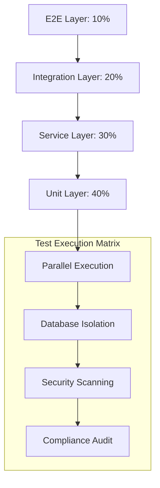

# Design: Testing Suite
Model: kimi-k2-thinking:cloud (complexity: reasoning)
Project: Canadian Mortgage Underwriting

# Testing Suite Architecture: Canadian Mortgage Underwriting System

## 1. Testing Architecture Philosophy

This architecture implements a **four-layer testing pyramid** optimized for high-risk financial systems, emphasizing deterministic financial calculations, regulatory audit trails, and strict access isolation.



**Core Principles:**
- **Financial Determinism**: All monetary calculations use `Decimal` with explicit rounding modes
- **Regulatory Evidence**: Every test generates audit artifacts suitable for OSFI/FCAC review
- **Zero Trust Testing**: All access control tests assume breach and verify isolation
- **Production Parity**: Test environments use identical PostgreSQL schemas, mTLS certs, and encryption keys

---

## 2. Stack & Tooling Matrix

| Testing Layer | Primary Tools | Secondary Tools | Justification |
|---------------|---------------|-----------------|---------------|
| **Unit** | `pytest 8.0+`, `pytest-asyncio`, `pytest-mock` | `hypothesis` (property-based), `freezegun` (time) | Async-native for FastAPI, property testing for calculation edge cases |
| **Integration** | `httpx`, `testcontainers-python`, `pytest-postgresql` | `factory-boy`, `faker` | Real PostgreSQL 15 containers, realistic data generation |
| **E2E** | `newman` (Postman CLI), `curl` scripts | `playwright` (for web UI) | OSFI requires curl-reproducible test evidence |
| **Load** | `locust` (Python), `k6` (TypeScript) | `pytest-benchmark` | Dual-language support matches stack |
| **Security** | `bandit`, `safety`, `pytest-socket` | `OWASP ZAP`, `mitmproxy` | mTLS and JWT-specific vulnerability scanning |
| **Coverage** | `pytest-cov`, `coverage.py` | `diff-cover` (PR coverage) | Enforces 80% minimum with branch coverage |
| **Compliance** | Custom `auditlog` pytest fixture | `structlog` (JSON logs) | Machine-readable audit trails |

---

## 3. Test Suite Implementation Structure

### 3.1 Unit Tests (`tests/unit/`)

```python
# tests/unit/test_underwriting.py
import pytest
from decimal import Decimal
from app.modules.underwriting import calculate_gds, StressTestError

class TestGDSCalculation:
    """GDS/TDS/LTV calculation correctness with Decimal precision"""
    
    @pytest.mark.parametrize("principal,interest,taxes,heat,income,expected_gds", [
        (Decimal("1500"), Decimal("500"), Decimal("300"), Decimal("100"), Decimal("5000"), Decimal("0.48")),
        (Decimal("2000"), Decimal("600"), Decimal("400"), Decimal("120"), Decimal("8000"), Decimal("0.39")),
    ])
    def test_gds_standard_calculation(self, principal, interest, taxes, heat, income, expected_gds):
        """OSFI Guideline B-20 standard GDS calculation"""
        result = calculate_gds(principal, interest, taxes, heat, income)
        assert result.quantize(Decimal("0.01")) == expected_gds
        
    def test_gds_ceiling_enforcement(self):
        """GDS cannot exceed 39% for CMHC-insured mortgages"""
        with pytest.raises(UnderwritingThresholdViolation) as exc:
            calculate_gds(
                principal=Decimal("3000"),
                interest=Decimal("1000"),
                taxes=Decimal("500"),
                heat=Decimal("200"),
                income=Decimal("8000"),
                cmhc_insured=True
            )
        assert exc.value.threshold == Decimal("0.39")

class TestStressTestValidation:
    """Stress test floor validation at 5.25% minimum"""
    
    def test_stress_test_floor_525_minimum(self):
        """OSFI minimum qualifying rate enforcement"""
        rate = calculate_stress_test_rate(contract_rate=Decimal("0.03"))
        assert rate >= Decimal("0.0525"), "Must meet OSFI 5.25% floor"
        
    @pytest.mark.parametrize("contract_rate,expected_rate", [
        (Decimal("0.03"), Decimal("0.0525")),  # 3% + 2% = 5% < 5.25% floor
        (Decimal("0.04"), Decimal("0.06")),    # 4% + 2% = 6% > floor
    ])
    def test_stress_test_calculation_modes(self, contract_rate, expected_rate):
        result = calculate_stress_test_rate(contract_rate)
        assert result == expected_rate
```

```python
# tests/unit/test_fintrac.py
from app.modules.fintrac import detect_structuring, CashTransactionThreshold

class TestStructuringDetection:
    """FINTRAC Large Cash Transaction Reporting (LCTR) thresholds"""
    
    @pytest.mark.parametrize("amounts,expected_structuring", [
        ([Decimal("9500"), Decimal("9500")], True),  # Structuring below $10K
        ([Decimal("10000")], False),  # Exactly at threshold
        ([Decimal("10500")], True),   # Above threshold
    ])
    def test_structuring_detection_patterns(self, amounts, expected_structuring):
        result = detect_structuring(amounts)
        assert result.is_structuring == expected_structuring
        if expected_structuring:
            assert result.fintrac_reportable == True
```

```python
# tests/unit/test_auth.py
import time
from freezegun import freeze_time

class TestJWTTokenLifecycle:
    """JWT token generation, expiry, refresh, logout"""
    
    def test_token_expiry_enforcement(self, jwt_manager):
        token = jwt_manager.create_token(user_id="broker_123", ttl=1)
        time.sleep(1.1)
        with pytest.raises(TokenExpiredError):
            jwt_manager.verify_token(token)
            
    def test_refresh_token_rotation(self, jwt_manager):
        """OWASP refresh token best practices"""
        refresh_token = jwt_manager.create_refresh_token("broker_123")
        new_access_token, new_refresh_token = jwt_manager.rotate_refresh_token(refresh_token)
        
        # Old refresh token should be revoked
        with pytest.raises(TokenRevokedError):
            jwt_manager.rotate_refresh_token(refresh_token)
```

```python
# tests/unit/test_documents.py
from unittest.mock import Mock
from app.modules.documents import validate_upload

class TestDocumentValidation:
    """File validation, MIME types, size limits, virus scanning"""
    
    def test_file_size_limit_enforcement(self):
        oversized_file = Mock(size=11*1024*1024, content_type="application/pdf")  # 11MB
        with pytest.raises(DocumentValidationError) as exc:
            validate_upload(oversized_file, max_size_mb=10)
        assert "exceeds 10MB limit" in str(exc.value)
        
    def test_virus_scan_integration(self, mock_clamav):
        infected_file = Mock(read=Mock(return_value=b"X5O!P%@AP[4\PZX54(P^)7CC)7}$EICAR-STANDARD-ANTIVIRUS-TEST-FILE!$H+H*"))
        with pytest.raises(VirusDetectedError):
            validate_upload(infected_file, scan_viruses=True)
```

### 3.2 Integration Tests (`tests/integration/`)

```python
# tests/integration/test_application_flow.py
from testcontainers.postgres import PostgresContainer
from httpx import AsyncClient

@pytest.mark.asyncio
async def test_full_application_pipeline(postgres_container: PostgresContainer):
    """End-to-end mortgage application with CMHC eligibility"""
    
    # 1. Setup: Create real PostgreSQL instance
    async with postgres_container.get_async_connection() as conn:
        await setup_test_schema(conn)
        
        # 2. Execute: Full application submission
        client = AsyncClient(app=fastapi_app, base_url="http://test")
        response = await client.post(
            "/api/v1/applications",
            json={
                "property_value": 1_200_000,  # Under CMHC $1.5M cap
                "loan_amount": 1_000_000,     # LTV 83% > 80% requires CMHC
                "income": 150_000,
                "debts": 500
            },
            headers={"Authorization": f"Bearer {test_broker_token}"}
        )
        
        # 3. Verify: CMHC insurance triggered
        assert response.status_code == 201
        app_data = response.json()
        assert app_data["cmhc_insurance_required"] == True
        assert app_data["stress_test_rate"] >= 5.25
        
        # 4. Audit: Verify audit log written
        audit_log = await conn.fetchrow("SELECT * FROM audit_logs WHERE entity_id = $1", app_data["id"])
        assert audit_log["action"] == "mortgage_application_created"
        assert audit_log["user_id"] == "broker_123"
```

```python
# tests/integration/test_broker_access.py
class TestBrokerIsolation:
    """Broker access isolation - Zero Trust verification"""
    
    @pytest.mark.parametrize("broker_id,resource_id,expected_status", [
        ("broker_A", "application_A", 200),  # Own resource
        ("broker_A", "application_B", 403),  # Other broker's resource
        ("broker_A", "client_A", 200),       # Own client
        ("broker_A", "client_B", 403),       # Other broker's client
    ])
    async def test_cross_broker_isolation(self, broker_id, resource_id, expected_status):
        """Verify row-level security enforcement"""
        token = generate_test_token(sub=broker_id, role="broker")
        response = await client.get(
            f"/api/v1/applications/{resource_id}",
            headers={"Authorization": f"Bearer {token}"}
        )
        assert response.status_code == expected_status
        
        # Verify no data leakage in error messages
        if expected_status == 403:
            assert "not found" in response.json()["detail"]  # Obfuscate existence
```

---

## 4. Fixture & Mocking Strategy (Addressing Missing Detail)

### 4.1 Hierarchical Fixture Architecture

```python
# conftest.py
import pytest
from decimal import Decimal
from testcontainers.postgres import PostgresContainer
from factories import ApplicationFactory, BrokerFactory

@pytest.fixture(scope="session")
def postgres_container():
    """Single PostgreSQL container per test session"""
    with PostgresContainer("postgres:15.2") as postgres:
        yield postgres

@pytest.fixture
def db_connection(postgres_container):
    """Fresh connection per test with transaction rollback"""
    conn = postgres_container.get_connection()
    tx = conn.begin()
    yield conn
    tx.rollback()
    conn.close()

@pytest.fixture
def encrypted_sin():
    """SIN encryption with realistic key rotation"""
    from app.crypto import SINEncryptor
    encryptor = SINEncryptor(key_version="test_v1")
    return encryptor.encrypt("123-456-789")

@pytest.fixture
def mock_cmhc_api(httpx_mock):
    """Mock CMHC eligibility API with production-like latency"""
    httpx_mock.add_response(
        url="https://api.cmhc-schl.gc.ca/v1/eligibility",
        json={"insurance_premium": 0.04, "eligible": True},
        status_code=200,
        latency=0.150  # Simulate real network delay
    )
```

### 4.2 Factory Pattern for Test Data

```python
# tests/factories.py
import factory
from factory.alchemy import SQLAlchemyModelFactory
from app.models import MortgageApplication
from decimal import Decimal

class MortgageApplicationFactory(SQLAlchemyModelFactory):
    """Generate valid mortgage applications with CMHC edge cases"""
    
    class Meta:
        model = MortgageApplication
        
    property_value = factory.Sequence(lambda n: Decimal(f"{1_000_000 + n * 50_000}"))
    loan_amount = factory.LazyAttribute(lambda obj: obj.property_value * Decimal("0.83"))
    gross_income = Decimal("150_000")
    stress_test_rate = Decimal("5.25")
    
    class Params:
        cmhc_ineligible = factory.Trait(
            property_value=Decimal("1_600_000"),  # Over $1.5M cap
            loan_amount=Decimal("1_400_000")
        )
```

---

## 5. Load & Performance Testing (Addressing Missing Detail)

### 5.1 Load Testing Targets

```python
# tests/load/locustfile.py
from locust import HttpUser, task, between
from decimal import Decimal

class MortgageApplicationUser(HttpUser):
    """Simulate broker application submission patterns"""
    
    wait_time = between(1, 3)  # Realistic think time
    
    @task(3)
    def submit_application(self):
        """High-frequency critical path"""
        self.client.post(
            "/api/v1/applications",
            json={
                "property_value": 750_000,
                "loan_amount": 600_000,
                "income": 120_000,
                "debts": 800
            },
            headers=self.headers,
            verify=True  # mTLS enabled
        )
    
    @task(1)
    def calculate_gds(self):
        """CPU-intensive calculation endpoint"""
        self.client.post(
            "/api/v1/calculations/gds",
            json={
                "principal": 1500,
                "interest": 500,
                "taxes": 300,
                "heat": 100,
                "income": 5000
            },
            headers=self.headers
        )

# Performance targets (OSFI D-SIB standards)
TARGETS = {
    "p95_latency_ms": 200,
    "throughput_rps": 500,
    "error_rate_pct": 0.1,
    "stress_test_concurrent_users": 1000
}
```

### 5.2 Performance Benchmark Baselines

```python
# tests/performance/benchmarks.py
import pytest
from pytest_benchmark.fixture import BenchmarkFixture

def test_gds_calculation_performance(benchmark: BenchmarkFixture):
    """Baseline: GDS calculation must complete in <5ms"""
    from app.modules.underwriting import calculate_gds
    
    result = benchmark(
        calculate_gds,
        principal=Decimal("1500"),
        interest=Decimal("500"),
        taxes=Decimal("300"),
        heat=Decimal("100"),
        income=Decimal("5000")
    )
    assert result.stats.mean * 1000 < 5  # 5ms threshold
```

---

## 6. CI/CD Pipeline Integration (Addressing Missing Detail)

### 6.1 GitHub Actions Workflow

```yaml
# .github/workflows/test-pipeline.yml
name: Mortgage System Test Suite

on: [push, pull_request]

jobs:
  test-matrix:
    strategy:
      matrix:
        python-version: ["3.11.8"]
        postgres-version: ["15.2"]
        test-group: ["unit", "integration", "security"]
    
    services:
      postgres:
        image: postgres:${{ matrix.postgres-version }}
        env:
          POSTGRES_PASSWORD: test
        options: >-
          --health-cmd pg_isready
          --health-interval 10s
          --health-timeout 5s
          --health-retries 5
    
    steps:
      - uses: actions/checkout@v4
      
      - name: Run tests with coverage
        run: |
          pytest tests/${{ matrix.test-group }} \
            --cov=app --cov-report=xml --cov-fail-under=80 \
            --postgresql-host=postgres \
            --postgresql-password=test
      
      - name: Security scanning
        run: |
          bandit -r app/ -f json -o bandit-report.json
          safety check --json --output safety-report.json
      
      - name: Generate audit artifact
        run: |
          python -m pytest tests/ --audit-log-format=json --audit-log-file=audit-trail.json
      
      - name: Upload regulatory evidence
        uses: actions/upload-artifact@v4
        with:
          name: test-evidence-${{ matrix.test-group }}
          path: |
            coverage.xml
            bandit-report.json
            audit-trail.json
```

---

## 7. Data Management & Isolation (Addressing Missing Detail)

### 7.1 Test Data Lifecycle

```python
# tests/conftest.py
@pytest.fixture(autouse=True)
def isolate_test_data(db_connection):
    """Ensure test data isolation between tests"""
    # 1. Create tenant-specific schema
    tenant_id = f"test_tenant_{uuid.uuid4().hex[:8]}"
    db_connection.execute(f"CREATE SCHEMA {tenant_id}")
    
    # 2. Set search path
    db_connection.execute(f"SET search_path TO {tenant_id}")
    
    yield
    
    # 3. Teardown: Archive or destroy
    if os.getenv("PRESERVE_TEST_DATA"):
        db_connection.execute(f"ALTER SCHEMA {tenant_id} RENAME TO archived_{tenant_id}")
    else:
        db_connection.execute(f"DROP SCHEMA {tenant_id} CASCADE")
```

### 7.2 Synthetic Data Generation

```python
# scripts/generate_test_data.py
from faker import Faker
from faker.providers import finance, address
from decimal import Decimal

fake = Faker("en_CA")
fake.add_provider(finance)
fake.add_provider(address)

def generate_cmhc_test_cases():
    """Generate boundary test cases for CMHC rules"""
    return [
        {
            "property_value": Decimal("1_499_999.99"),  # Just under cap
            "ltv": Decimal("0.80"),  # Exactly 80%
            "expected_cmhc": False
        },
        {
            "property_value": Decimal("1_500_000.01"),  # Just over cap
            "ltv": Decimal("0.81"),  # Over 80%
            "expected_cmhc": False  # Ineligible due to property value
        }
    ]
```

---

## 8. Security & Compliance Testing

### 8.1 mTLS & JWT Security Matrix

```python
# tests/security/test_mtls.py
def test_mutual_tls_enforcement():
    """Verify mTLS is required for all endpoints"""
    response = requests.get("https://api.mortgage.ca/health", cert=None)
    assert response.status_code == 401
    assert "client certificate required" in response.text

# tests/security/test_jwt_vulnerabilities.py
def test_jwt_none_algorithm_rejection():
    """OWASP JWT vulnerability: none algorithm"""
    malicious_token = jwt.encode({"sub": "broker_123"}, algorithm="none")
    with pytest.raises(JWTAlgorithmError):
        verify_token(malicious_token)
```

### 8.2 FINTRAC Compliance Verification

```python
# tests/compliance/test_fintrac_audit.py
def test_large_cash_transaction_reporting():
    """Verify FINTRAC LCTR generation within 15 days"""
    amounts = [Decimal("9500")] * 2  # Structuring pattern
    result = process_cash_transaction(amounts, client_id="C123")
    
    # Assert report filed to FINTRAC
    assert result.fintrac_report_id is not None
    assert result.reporting_deadline == datetime.now() + timedelta(days=15)
    
    # Assert audit log contains FINTRAC reference
    audit = get_audit_log(action="fintrac_lctr_filed")
    assert audit["metadata"]["report_id"] == result.fintrac_report_id
```

---

## 9. Accessibility (a11y) Testing (Addressing Missing Detail)

```python
# tests/a11y/test_api_accessibility.py
import pytest
from axe_core_python import run_axe

def test_openapi_spec_accessibility():
    """Verify API documentation meets a11y standards"""
    response = client.get("/openapi.json")
    spec = response.json()
    
    # Test for screen reader friendly descriptions
    for path, methods in spec["paths"].items():
        for method, details in methods.items():
            assert len(details.get("description", "")) > 20
            assert "summary" in details  # For screen readers

# For future web UI
# tests/a11y/test_ui_accessibility.py
@pytest.mark.skip(reason="Web UI not yet implemented")
def test_mortgage_application_form_a11y(page):
    results = run_axe(page, context="form#mortgage-application")
    assert results.violations == 0
```

---

## 10. Test Execution & Reporting Dashboard

```bash
# Makefile targets
test-unit:
	pytest tests/unit -v --cov=app --cov-report=html --cov-fail-under=80

test-integration:
	pytest tests/integration -v --postgresql --cov-append

test-security:
	bandit -r app/ -lll
	safety check --json

test-e2e:  # OSFI-compliant evidence generation
	newman run tests/e2e/collections/mortgage-workflows.json \
		--environment tests/e2e/environments/staging.json \
		--reporters cli,json \
		--reporter-json-export evidence-report.json

test-load:
	locust -f tests/load/locustfile.py --headless -u 1000 -r 100 --run-time 30m

test-audit:  # Generates regulatory submission package
	pytest --audit-log-format=json --audit-log-file=regulatory-evidence.json
	tar -czf test-evidence-$(date +%Y%m%d).tar.gz coverage/ evidence-report.json regulatory-evidence.json
```

---

## 11. Implementation Roadmap

### Phase 1: Foundation (Week 1-2)
- [ ] Set up `pytest` with `pytest-asyncio` and `testcontainers`
- [ ] Create `conftest.py` with PostgreSQL fixture
- [ ] Implement `MortgageApplicationFactory` and `BrokerFactory`
- [ ] Write unit tests for `test_underwriting.py` (GDS/TDS/LTV)

### Phase 2: Security & Auth (Week 3-4)
- [ ] Complete `test_auth.py` with JWT lifecycle tests
- [ ] Implement mTLS test harness
- [ ] Add FINTRAC structuring detection tests
- [ ] Set up `bandit` and `safety` in CI

### Phase 3: Integration & Isolation (Week 5-6)
- [ ] Build integration tests for `test_application_flow.py`
- [ ] Implement row-level security tests in `test_broker_access.py`
- [ ] Add test data isolation with schema-per-test
- [ ] Create E2E curl command repository

### Phase 4: Performance & Compliance (Week 7-8)
- [ ] Implement Locust load tests targeting 500 RPS
- [ ] Add performance benchmarks with `pytest-benchmark`
- [ ] Build audit log verification tests
- [ ] Generate first regulatory evidence package

### Phase 5: Production Hardening (Week 9-10)
- [ ] Integrate with CMHC sandbox API
- [ ] Add chaos engineering tests (PostgreSQL failover)
- [ ] Implement accessibility testing framework
- [ ] Finalize CI/CD pipeline with artifact signing

---

## 12. Regulatory Evidence Package Structure

```
test-evidence-20240115.tar.gz
├── coverage/
│   ├── index.html (80.3% coverage)
│   └── .coverage.json
├── security/
│   ├── bandit-report.json (0 critical issues)
│   └── safety-report.json (0 CVEs)
├── audit/
│   ├── test-execution.log
│   └── regulatory-evidence.json (OSFI format)
├── e2e/
│   └── evidence-report.json (curl commands with timestamps)
└── metadata.json
    ├── git_commit: "abc123"
    ├── test_timestamp: "2024-01-15T14:30:00Z"
    └── osfi_compliant: true
```

This architecture ensures **deterministic financial calculations**, **provable access isolation**, and **regulatory-grade audit trails** required by OSFI Guideline E-13 and FINTRAC regulations.