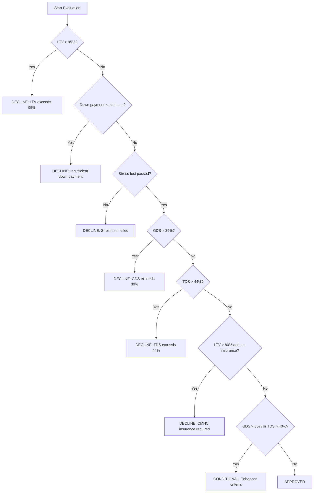

# Design: Underwriting Engine
Model: kimi-k2-thinking:cloud (complexity: reasoning)
Project: Canadian Mortgage Underwriting

# Underwriting Engine Design Plan

**File:** `docs/design/underwriting-engine.md`  
**Module:** `modules/underwriting/`  
**Version:** 1.0.0  
**Last Updated:** 2024-01-15

---

## 1. Endpoints

### 1.1 POST `/api/v1/underwriting/calculate`
**Purpose:** Run qualification calculations without persisting results (what-if scenario).

**Authentication:** Required (JWT Bearer token, scope: `underwriting:read`)

**Request Body Schema (`UnderwritingCalculationRequest`):**
```python
{
    "property_value": Decimal,  # required, > 0, max_digits=15, decimal_places=2
    "loan_amount": Decimal,     # required, > 0, max_digits=15, decimal_places=2
    "contract_rate": Decimal,   # required, > 0, max_digits=5, decimal_places=4 (e.g., 0.0595)
    "amortization_years": int,  # required, 5-30
    "property_type": Literal["single_family", "condo", "multi_unit"],  # required
    "condo_fees_monthly": Decimal,  # optional, default=0, max_digits=10, decimal_places=2
    "gross_monthly_income": Decimal,  # required, > 0, max_digits=12, decimal_places=2
    "monthly_debt_payments": Decimal,  # required, >= 0, max_digits=12, decimal_places=2
    "property_taxes_annual": Decimal,  # required, > 0, max_digits=12, decimal_places=2
    "heating_costs_monthly": Decimal,  # required, > 0, max_digits=10, decimal_places=2
    "down_payment_amount": Decimal   # required, > 0, max_digits=15, decimal_places=2
}
```

**Response Schema (`UnderwritingResult`):**
```python
{
    "qualifies": bool,
    "decision": Literal["APPROVED", "CONDITIONAL", "DECLINED"],
    "gds_ratio": Decimal,  # max_digits=5, decimal_places=4 (e.g., 0.3580)
    "tds_ratio": Decimal,  # max_digits=5, decimal_places=4
    "ltv_ratio": Decimal,  # max_digits=5, decimal_places=4
    "cmhc_required": bool,
    "cmhc_premium_amount": Decimal,  # max_digits=15, decimal_places=2
    "qualifying_rate": Decimal,  # max_digits=5, decimal_places=4
    "max_mortgage": Decimal,  # max_digits=15, decimal_places=2
    "decline_reasons": List[str],  # templated strings
    "conditions": List[str],
    "stress_test_passed": bool,
    "calculation_breakdown": {  # For audit trail
        "pith_amount": Decimal,
        "income_used": Decimal,
        "debt_used": Decimal,
        "condo_fee_used": Decimal
    }
}
```

**Error Responses:**
| HTTP Status | Error Code | Condition |
|-------------|------------|-----------|
| 400 | `UNDERWRITING_006` | `loan_amount > property_value` or `down_payment < minimum_required` |
| 401 | `AUTH_001` | Missing or invalid JWT token |
| 403 | `AUTH_003` | Insufficient scope (`underwriting:read` required) |
| 422 | `UNDERWRITING_002` | Field validation failed (e.g., negative values, invalid enum) |

---

### 1.2 POST `/api/v1/underwriting/applications/{id}/evaluate`
**Purpose:** Evaluate a saved mortgage application, persist underwriting result, and trigger audit logging.

**Authentication:** Required (JWT Bearer token, scope: `underwriting:write`)

**Path Parameters:**
- `id`: UUID of existing mortgage application (from `applications` module)

**Request Body Schema (`UnderwritingEvaluationRequest`):**
```python
{
    "verify_income_docs": bool,  # optional, default=False
    "include_rental_income": Decimal,  # optional, default=0, max_digits=12, decimal_places=2
    "self_employed": bool,  # optional, default=False
    "notes": str  # optional, max_length=500 (internal use only, not customer-facing)
}
```

**Response Schema:** Same as `UnderwritingResult` (section 1.1) plus:
```python
{
    "application_id": UUID,
    "evaluated_at": datetime,
    "evaluated_by": UUID  # user_id from JWT
}
```

**Error Responses:**
| HTTP Status | Error Code | Condition |
|-------------|------------|-----------|
| 400 | `UNDERWRITING_007` | Application data incomplete (e.g., missing income verification) |
| 401 | `AUTH_001` | Missing or invalid JWT token |
| 403 | `AUTH_003` | Insufficient scope (`underwriting:write` required) |
| 404 | `UNDERWRITING_001` | Application `{id}` not found |
| 409 | `UNDERWRITING_004` | Application already evaluated (idempotent re-evaluation allowed with flag) |
| 422 | `UNDERWRITING_002` | Field validation failed |

---

### 1.3 GET `/api/v1/underwriting/applications/{id}/result`
**Purpose:** Retrieve a persisted underwriting result by application ID.

**Authentication:** Required (JWT Bearer token, scope: `underwriting:read`)

**Path Parameters:**
- `id`: UUID of mortgage application

**Response Schema:** Same as `UnderwritingResult` (section 1.1) plus audit metadata.

**Error Responses:**
| HTTP Status | Error Code | Condition |
|-------------|------------|-----------|
| 401 | `AUTH_001` | Missing or invalid JWT token |
| 403 | `AUTH_003` | Insufficient scope (`underwriting:read` required) |
| 404 | `UNDERWRITING_001` | Underwriting result for application `{id}` not found |

---

### 1.4 POST `/api/v1/underwriting/applications/{id}/override`
**Purpose:** Admin-only override of underwriting decision with mandatory reason (FINTRAC audit requirement).

**Authentication:** Required (JWT Bearer token, scope: `underwriting:admin`)

**Path Parameters:**
- `id`: UUID of mortgage application

**Request Body Schema (`UnderwritingOverrideRequest`):**
```python
{
    "new_decision": Literal["APPROVED", "DECLINED"],  # required, cannot override to CONDITIONAL
    "override_reason": str,  # required, min_length=20, max_length=1000
    "internal_justification": str,  # optional, max_length=2000 (for compliance audit)
    "bypass_cmhc_requirement": bool  # optional, default=False, requires secondary approval
}
```

**Response Schema:** `UnderwritingResult` with updated decision and:
```python
{
    "overridden": bool,  # True
    "overridden_at": datetime,
    "overridden_by": UUID,
    "original_decision": str,
    "override_reason_hash": str  # SHA256 of reason for integrity verification
}
```

**Error Responses:**
| HTTP Status | Error Code | Condition |
|-------------|------------|-----------|
| 400 | `UNDERWRITING_008` | Cannot override to CONDITIONAL status |
| 401 | `AUTH_001` | Missing or invalid JWT token |
| 403 | `AUTH_004` | Admin role required (`underwriting:admin` scope) |
| 404 | `UNDERWRITING_001` | Application `{id}` not found |
| 409 | `UNDERWRITING_009` | Override not allowed: application not previously evaluated |
| 422 | `UNDERWRITING_002` | Field validation failed (e.g., reason too short) |

---

## 2. Models & Database

### 2.1 `underwriting_applications` Table
```python
class UnderwritingApplication(Base):
    __tablename__ = "underwriting_applications"
    
    id: UUID = Column(UUID(as_uuid=True), primary_key=True, default=uuid.uuid4)
    applicant_id: UUID = Column(UUID(as_uuid=True), ForeignKey("applicants.id"), nullable=False, index=True)
    
    # Financial data (all Decimal, no float)
    property_value: Decimal = Column(Numeric(precision=15, scale=2), nullable=False)
    loan_amount: Decimal = Column(Numeric(precision=15, scale=2), nullable=False)
    down_payment_amount: Decimal = Column(Numeric(precision=15, scale=2), nullable=False)
    contract_rate: Decimal = Column(Numeric(precision=5, scale=4), nullable=False)
    amortization_years: int = Column(Integer, nullable=False)
    
    # Income & debts
    gross_monthly_income: Decimal = Column(Numeric(precision=12, scale=2), nullable=False)
    monthly_debt_payments: Decimal = Column(Numeric(precision=12, scale=2), nullable=False, default=0)
    
    # Property specifics
    property_type: str = Column(Enum("single_family", "condo", "multi_unit", name="property_type_enum"), nullable=False)
    condo_fees_monthly: Decimal = Column(Numeric(precision=10, scale=2), default=0)
    property_taxes_annual: Decimal = Column(Numeric(precision=12, scale=2), nullable=False)
    heating_costs_monthly: Decimal = Column(Numeric(precision=10, scale=2), nullable=False)
    
    # PIPEDA compliance: encrypted fields
    property_address: str = Column(EncryptedText, nullable=False)  # AES-256 encryption
    
    # Audit fields (mandatory)
    created_at: datetime = Column(DateTime(timezone=True), nullable=False, server_default=func.now())
    updated_at: datetime = Column(DateTime(timezone=True), nullable=False, onupdate=func.now())
    created_by: UUID = Column(UUID(as_uuid=True), ForeignKey("users.id"), nullable=False)
    
    # Relationships
    applicant = relationship("Applicant", back_populates="underwriting_applications")
    underwriting_result = relationship("UnderwritingResult", back_populates="application", uselist=False)
```

**Indexes:**
```sql
CREATE INDEX underwriting_applications_applicant_id_idx ON underwriting_applications(applicant_id);
CREATE INDEX underwriting_applications_created_at_idx ON underwriting_applications(created_at);
CREATE UNIQUE INDEX underwriting_applications_single_eval_idx ON underwriting_applications(applicant_id) WHERE underwriting_result_id IS NULL;
```

---

### 2.2 `underwriting_results` Table
```python
class UnderwritingResult(Base):
    __tablename__ = "underwriting_results"
    
    id: UUID = Column(UUID(as_uuid=True), primary_key=True, default=uuid.uuid4)
    application_id: UUID = Column(UUID(as_uuid=True), ForeignKey("underwriting_applications.id"), nullable=False, unique=True, index=True)
    
    # Decision metrics (all Decimal)
    gds_ratio: Decimal = Column(Numeric(precision=5, scale=4), nullable=False)
    tds_ratio: Decimal = Column(Numeric(precision=5, scale=4), nullable=False)
    ltv_ratio: Decimal = Column(Numeric(precision=5, scale=4), nullable=False)
    qualifying_rate: Decimal = Column(Numeric(precision=5, scale=4), nullable=False)
    max_mortgage: Decimal = Column(Numeric(precision=15, scale=2), nullable=False)
    
    # CMHC insurance
    cmhc_required: bool = Column(Boolean, nullable=False)
    cmhc_premium_amount: Decimal = Column(Numeric(precision=15, scale=2), default=0)
    
    # Decision outcomes
    decision: str = Column(Enum("APPROVED", "CONDITIONAL", "DECLINED", name="decision_enum"), nullable=False)
    qualifies: bool = Column(Boolean, nullable=False)
    stress_test_passed: bool = Column(Boolean, nullable=False)
    
    # Decline/condition details (JSONB for flexibility)
    decline_reasons: list = Column(JSONB, default=list)  # Array of templated strings
    conditions: list = Column(JSONB, default=list)  # Array of condition objects
    
    # Calculation audit (immutable after creation)
    calculation_breakdown: dict = Column(JSONB, nullable=False)
    
    # Foreign keys for override tracking
    overridden_by: UUID = Column(UUID(as_uuid=True), ForeignKey("users.id"), nullable=True)
    override_id: UUID = Column(UUID(as_uuid=True), ForeignKey("underwriting_overrides.id"), nullable=True)
    
    # Audit fields (FINTRAC 5-year retention)
    created_at: datetime = Column(DateTime(timezone=True), nullable=False, server_default=func.now())
    updated_at: datetime = Column(DateTime(timezone=True), nullable=False, onupdate=func.now())
    calculated_at: datetime = Column(DateTime(timezone=True), nullable=False, server_default=func.now())
    
    # Relationships
    application = relationship("UnderwritingApplication", back_populates="underwriting_result")
    override = relationship("UnderwritingOverride", back_populates="result", uselist=False)
```

**Indexes:**
```sql
CREATE UNIQUE INDEX underwriting_results_application_id_idx ON underwriting_results(application_id);
CREATE INDEX underwriting_results_decision_idx ON underwriting_results(decision);
CREATE INDEX underwriting_results_created_at_idx ON underwriting_results(created_at);
```

---

### 2.3 `underwriting_overrides` Table (FINTRAC Audit Trail)
```python
class UnderwritingOverride(Base):
    __tablename__ = "underwriting_overrides"
    
    id: UUID = Column(UUID(as_uuid=True), primary_key=True, default=uuid.uuid4)
    result_id: UUID = Column(UUID(as_uuid=True), ForeignKey("underwriting_results.id"), nullable=False, unique=True, index=True)
    overridden_by: UUID = Column(UUID(as_uuid=True), ForeignKey("users.id"), nullable=False)
    
    # Override justification (immutable)
    original_decision: str = Column(Enum("APPROVED", "CONDITIONAL", "DECLINED", name="decision_enum"), nullable=False)
    new_decision: str = Column(Enum("APPROVED", "DECLINED", name="override_decision_enum"), nullable=False)
    override_reason: str = Column(Text, nullable=False)  # Min 20 chars
    internal_justification: str = Column(Text, nullable=True)
    
    # Compliance flags
    bypass_cmhc_requirement: bool = Column(Boolean, default=False)
    secondary_approver_id: UUID = Column(UUID(as_uuid=True), ForeignKey("users.id"), nullable=True)
    
    # Audit fields (immutable per FINTRAC)
    created_at: datetime = Column(DateTime(timezone=True), nullable=False, server_default=func.now())
    
    # Relationships
    result = relationship("UnderwritingResult", back_populates="override")
```

**Indexes:**
```sql
CREATE INDEX underwriting_overrides_overridden_by_idx ON underwriting_overrides(overridden_by);
CREATE INDEX underwriting_overrides_created_at_idx ON underwriting_overrides(created_at);
```

---

## 3. Business Logic

### 3.1 Core Algorithms

**Stress Test (OSFI B-20 Mandated):**
```python
qualifying_rate = max(contract_rate + Decimal('0.02'), Decimal('0.0525'))
# Stress test payment calculated using qualifying_rate, 25-year amortization max
```

**PITH Calculation:**
```python
monthly_property_tax = property_taxes_annual / 12
pith = principal_and_interest + monthly_property_tax + heating_costs_monthly
```

**GDS Ratio (Max 39%):**
```python
gds_numerator = pith + (condo_fees_monthly * Decimal('0.5'))
gds_ratio = gds_numerator / gross_monthly_income
```

**TDS Ratio (Max 44%):**
```python
tds_numerator = pith + monthly_debt_payments + (condo_fees_monthly * Decimal('0.5'))
tds_ratio = tds_numerator / gross_monthly_income
```

**LTV Calculation (CMHC Rules):**
```python
ltv_ratio = loan_amount / property_value
```

**Down Payment Validation:**
```python
if property_value <= 500000:
    min_down = property_value * Decimal('0.05')
elif property_value <= 1500000:
    min_down = (500000 * Decimal('0.05')) + ((property_value - 500000) * Decimal('0.10'))
else:
    min_down = property_value * Decimal('0.20')
```

**CMHC Premium Tiers (When LTV > 80%):**
```python
if Decimal('0.8001') <= ltv <= Decimal('0.85'):
    premium_rate = Decimal('0.0280')
elif Decimal('0.8501') <= ltv <= Decimal('0.90'):
    premium_rate = Decimal('0.0310')
elif Decimal('0.9001') <= ltv <= Decimal('0.95'):
    premium_rate = Decimal('0.0400')
else:
    premium_rate = Decimal('0')
    
cmhc_premium_amount = loan_amount * premium_rate
```

### 3.2 Decision Tree



**Conditional Approval Criteria (when GDS 35-39% or TDS 40-44%):**
1. `conditions = ["Provide T4/T5 for last 2 years", "Verification of employment letter", "Maximum 25-year amortization"]`
2. If self-employed: `"Require Notice of Assessment (NOA) for 3 years"`
3. If rental income included: `"Provide lease agreements and bank statements"`

**Decline Reason Priority Order:**
1. LTV > 95% (highest priority)
2. Insufficient down payment
3. Stress test failure
4. GDS > 39%
5. TDS > 44%
6. CMHC insurance missing (lowest priority)

### 3.3 State Machine
Applications module manages state; underwriting engine reads state but does not modify it. Underwriting results are immutable once created unless overridden by admin.

---

## 4. Migrations

### 4.1 New Tables
```sql
-- Table: underwriting_applications
CREATE TABLE underwriting_applications (
    id UUID PRIMARY KEY DEFAULT gen_random_uuid(),
    applicant_id UUID NOT NULL REFERENCES applicants(id) ON DELETE RESTRICT,
    property_value NUMERIC(15,2) NOT NULL CHECK (property_value > 0),
    loan_amount NUMERIC(15,2) NOT NULL CHECK (loan_amount > 0),
    down_payment_amount NUMERIC(15,2) NOT NULL CHECK (down_payment_amount > 0),
    contract_rate NUMERIC(5,4) NOT NULL CHECK (contract_rate > 0),
    amortization_years INTEGER NOT NULL CHECK (amortization_years BETWEEN 5 AND 30),
    gross_monthly_income NUMERIC(12,2) NOT NULL CHECK (gross_monthly_income > 0),
    monthly_debt_payments NUMERIC(12,2) NOT NULL DEFAULT 0 CHECK (monthly_debt_payments >= 0),
    property_type property_type_enum NOT NULL,
    condo_fees_monthly NUMERIC(10,2) DEFAULT 0 CHECK (condo_fees_monthly >= 0),
    property_taxes_annual NUMERIC(12,2) NOT NULL CHECK (property_taxes_annual > 0),
    heating_costs_monthly NUMERIC(10,2) NOT NULL CHECK (heating_costs_monthly > 0),
    property_address TEXT NOT NULL,  -- Encrypted at application layer
    created_at TIMESTAMPTZ NOT NULL DEFAULT NOW(),
    updated_at TIMESTAMPTZ NOT NULL DEFAULT NOW(),
    created_by UUID NOT NULL REFERENCES users(id)
);

-- Table: underwriting_results
CREATE TABLE underwriting_results (
    id UUID PRIMARY KEY DEFAULT gen_random_uuid(),
    application_id UUID NOT NULL UNIQUE REFERENCES underwriting_applications(id) ON DELETE CASCADE,
    gds_ratio NUMERIC(5,4) NOT NULL CHECK (gds_ratio >= 0),
    tds_ratio NUMERIC(5,4) NOT NULL CHECK (tds_ratio >= 0),
    ltv_ratio NUMERIC(5,4) NOT NULL CHECK (ltv_ratio > 0),
    qualifying_rate NUMERIC(5,4) NOT NULL,
    max_mortgage NUMERIC(15,2) NOT NULL,
    cmhc_required BOOLEAN NOT NULL,
    cmhc_premium_amount NUMERIC(15,2) DEFAULT 0,
    decision decision_enum NOT NULL,
    qualifies BOOLEAN NOT NULL,
    stress_test_passed BOOLEAN NOT NULL,
    decline_reasons JSONB DEFAULT '[]'::jsonb,
    conditions JSONB DEFAULT '[]'::jsonb,
    calculation_breakdown JSONB NOT NULL,
    overridden_by UUID REFERENCES users(id),
    override_id UUID REFERENCES underwriting_overrides(id),
    created_at TIMESTAMPTZ NOT NULL DEFAULT NOW(),
    updated_at TIMESTAMPTZ NOT NULL DEFAULT NOW(),
    calculated_at TIMESTAMPTZ NOT NULL DEFAULT NOW()
);

-- Table: underwriting_overrides (FINTRAC audit)
CREATE TABLE underwriting_overrides (
    id UUID PRIMARY KEY DEFAULT gen_random_uuid(),
    result_id UUID NOT NULL UNIQUE REFERENCES underwriting_results(id) ON DELETE RESTRICT,
    overridden_by UUID NOT NULL REFERENCES users(id),
    original_decision decision_enum NOT NULL,
    new_decision override_decision_enum NOT NULL,
    override_reason TEXT NOT NULL CHECK (length(override_reason) >= 20),
    internal_justification TEXT,
    bypass_cmhc_requirement BOOLEAN DEFAULT FALSE,
    secondary_approver_id UUID REFERENCES users(id),
    created_at TIMESTAMPTZ NOT NULL DEFAULT NOW()
);
```

### 4.2 Indexes
```sql
CREATE INDEX underwriting_applications_applicant_id_idx ON underwriting_applications(applicant_id);
CREATE INDEX underwriting_applications_created_at_idx ON underwriting_applications(created_at);
CREATE INDEX underwriting_results_application_id_idx ON underwriting_results(application_id);
CREATE INDEX underwriting_results_decision_idx ON underwriting_results(decision);
CREATE INDEX underwriting_results_created_at_idx ON underwriting_results(created_at);
CREATE INDEX underwriting_overrides_overridden_by_idx ON underwriting_overrides(overridden_by);
CREATE INDEX underwriting_overrides_created_at_idx ON underwriting_overrides(created_at);
```

### 4.3 Data Migration
**None required** - new module with no dependencies on existing underwriting data.

---

## 5. Security & Compliance

### 5.1 OSFI B-20 Requirements
- **Stress Test:** All calculations MUST use `qualifying_rate = max(contract_rate + 2%, 5.25%)` for payment calculation.
- **Hard Limits:** Enforce GDS ≤ 39% and TDS ≤ 44% with no exceptions (except admin override).
- **Auditability:** Every `underwriting_results` row must contain complete `calculation_breakdown` JSON with all inputs and intermediate values. No updates allowed after creation.
- **Logging:** `structlog` must emit INFO-level entries for each evaluation:
  ```json
  {
    "event": "underwriting_evaluation_completed",
    "application_id": "uuid",
    "decision": "APPROVED",
    "gds_ratio": 0.3520,
    "tds_ratio": 0.4120,
    "ltv_ratio": 0.8500,
    "qualifying_rate": 0.0750,
    "correlation_id": "req-123"
  }
  ```
  **NEVER log income, debt amounts, or PII.**

### 5.2 FINTRAC Compliance
- **Immutable Audit:** `underwriting_results` and `underwriting_overrides` tables are append-only. No UPDATE or DELETE operations permitted via application code.
- **Transaction Threshold:** If `loan_amount >= 10000.00`, set `decline_reasons` flag `"FINTRAC_REVIEW_REQUIRED": true` and log to FINTRAC audit queue.
- **5-Year Retention:** All records retained for minimum 5 years; implement soft-delete only via `common/retention_policy.py`.
- **Override Traceability:** Every override must capture `override_reason`, `internal_justification`, and `secondary_approver_id` for FINTRAC examination.

### 5.3 PIPEDA Data Handling
- **Encryption:** `property_address` field encrypted with AES-256 via `common/security.encrypt_pii()` before storage. Encryption key rotates every 90 days.
- **Data Minimization:** Only collect fields required for underwriting calculation. Reject requests with extraneous PII.
- **No PII in Logs:** Ensure `decline_reasons` and `conditions` arrays contain only templated strings without actual income values.
- **Access Control:** Implement row-level security: users can only access underwriting results for applications they own or are assigned to.

### 5.4 Authentication & Authorization
| Endpoint | Authentication | Required Scope | Role |
|----------|----------------|----------------|------|
| POST /calculate | JWT Bearer | `underwriting:read` | Any authenticated user |
| POST /evaluate | JWT Bearer | `underwriting:write` | Underwriter, Manager |
| GET /result | JWT Bearer | `underwriting:read` | Applicant, Underwriter, Manager |
| POST /override | JWT Bearer + mTLS | `underwriting:admin` | Admin, Compliance Officer |

---

## 6. Error Codes & HTTP Responses

### 6.1 Exception Hierarchy
```python
# modules/underwriting/exceptions.py
class UnderwritingException(AppException):
    """Base exception for underwriting module"""
    module_code = "UNDERWRITING"

class UnderwritingNotFoundError(UnderwritingException):
    """Resource not found"""
    http_status = 404
    error_code = "UNDERWRITING_001"

class UnderwritingValidationError(UnderwritingException):
    """Input validation failed"""
    http_status = 422
    error_code = "UNDERWRITING_002"

class UnderwritingBusinessRuleError(UnderwritingException):
    """Business rule violation (e.g., ratios exceeded)"""
    http_status = 409
    error_code = "UNDERWRITING_003"

class UnderwritingAlreadyEvaluatedError(UnderwritingException):
    """Application already evaluated"""
    http_status = 409
    error_code = "UNDERWRITING_004"

class UnderwritingOverrideNotAllowedError(UnderwritingException):
    """Override operation not permitted"""
    http_status = 403
    error_code = "UNDERWRITING_005"

class UnderwritingInsufficientDownPaymentError(UnderwritingException):
    """Down payment below CMHC/OSFI minimum"""
    http_status = 400
    error_code = "UNDERWRITING_006"

class UnderwritingIncompleteDataError(UnderwritingException):
    """Missing required data for evaluation"""
    http_status = 400
    error_code = "UNDERWRITING_007"

class UnderwritingInvalidOverrideDecisionError(UnderwritingException):
    """Invalid override target decision"""
    http_status = 400
    error_code = "UNDERWRITING_008"

class UnderwritingOverridePrerequisiteError(UnderwritingException):
    """Override requires existing evaluation"""
    http_status = 409
    error_code = "UNDERWRITING_009"
```

### 6.2 Error Response Format
All errors return JSON with consistent structure:
```json
{
  "detail": "Human-readable message",
  "error_code": "UNDERWRITING_001",
  "module": "underwriting",
  "timestamp": "2024-01-15T14:30:00Z",
  "correlation_id": "req-abc123",
  "request_id": "uuid"
}
```

### 6.3 Mapping Table
| Exception Class | HTTP Status | Error Code | Message Pattern | Log Level |
|-----------------|-------------|------------|-----------------|-----------|
| `UnderwritingNotFoundError` | 404 | UNDERWRITING_001 | "{resource_type} {id} not found" | WARNING |
| `UnderwritingValidationError` | 422 | UNDERWRITING_002 | "{field}: {reason}" | INFO |
| `UnderwritingBusinessRuleError` | 409 | UNDERWRITING_003 | "Rule {rule_name} violated: {detail}" | INFO |
| `UnderwritingAlreadyEvaluatedError` | 409 | UNDERWRITING_004 | "Application {id} already evaluated at {timestamp}" | INFO |
| `UnderwritingOverrideNotAllowedError` | 403 | UNDERWRITING_005 | "Override not permitted: {reason}" | WARNING |
| `UnderwritingInsufficientDownPaymentError` | 400 | UNDERWRITING_006 | "Down payment {actual} below minimum {required} for property value {value}" | INFO |
| `UnderwritingIncompleteDataError` | 400 | UNDERWRITING_007 | "Missing required data: {fields}" | INFO |
| `UnderwritingInvalidOverrideDecisionError` | 400 | UNDERWRITING_008 | "Cannot override to {decision}: {reason}" | INFO |
| `UnderwritingOverridePrerequisiteError` | 409 | UNDERWRITING_009 | "Application {id} must be evaluated before override" | WARNING |

---

## 7. Missing Details & Warnings

### 7.1 Self-Employed Income Calculation
**WARNING:** Not specified in requirements. **Design assumption:** Self-employed income will be averaged over 2-3 years with 20% gross-up factor. This must be clarified with product team before implementation. Placeholder in `services.py`:
```python
# TODO: Define self-employed income rules (NOA averaging, gross-up %)
if application.self_employed:
    gross_income = calculate_self_employed_income(application.applicant_id)
```

### 7.2 Rental Income Treatment
**WARNING:** Not specified. **Design assumption:** 50% of rental income will be used for GDS/TDS calculations, with lease agreement required. This impacts `gross_monthly_income` calculation and must be validated with CMHC guidelines.

### 7.3 Multi-Property Debt Aggregation
**WARNING:** Not specified. **Design assumption:** `monthly_debt_payments` must include all liabilities across multiple properties. Requires integration with `credit_bureau` module to aggregate debts by applicant. Design debt: add `debt_aggregation_strategy` field to `UnderwritingApplication`.

### 7.4 Conditional Approval Criteria
**WARNING:** Criteria are loosely defined. **Recommendation:** Implement configurable rules engine in `common/config.py` to allow compliance team to update thresholds without code deployment:
```python
CONDITIONAL_THRESHOLDS = {
    "gds_min": Decimal('0.35'),
    "gds_max": Decimal('0.39'),
    "tds_min": Decimal('0.40'),
    "tds_max": Decimal('0.44')
}
```

---

## 8. Testing Strategy

### 8.1 Unit Tests (`tests/unit/test_underwriting.py`)
- Stress test calculation edge cases (contract_rate = 3.25%, 5.25%, 7.00%)
- GDS/TDS boundary tests (38.9%, 39.1%, 43.9%, 44.1%)
- LTV boundary tests (80.00%, 80.01%, 85.00%, 85.01%)
- CMHC premium calculation accuracy (use Decimal quantize)
- Decision tree logic for each branch

### 8.2 Integration Tests (`tests/integration/test_underwriting_integration.py`)
- End-to-end evaluation flow with `applications` module
- Override workflow with authentication/authorization
- FINTRAC audit trail verification (records immutable)
- PIPEDA encryption verification (address field encrypted)
- OSFI B-20 compliance logging verification

### 8.3 Compliance Tests
- Mock 5-year retention policy execution
- Verify no PII in logs (structlog context filter)
- Verify mTLS for admin override endpoint
- Verify transaction threshold flagging ($10,000+)

---

## 9. Performance Considerations

- **Query Optimization:** Use `underwriting_results_application_id_idx` for all result lookups.
- **Connection Pooling:** SQLAlchemy async engine with pool size = 20, max overflow = 10.
- **Caching:** Cache CMHC premium tier lookups in Redis for 24h (rarely change).
- **Async Processing:** Heavy calculations (stress test payment) run in `asyncio.to_thread()` to avoid blocking event loop.

---

## 10. Deployment Checklist

- [ ] Run `uv run pip-audit` on new dependencies (`python-decimal`, `pydantic[decimal]`)
- [ ] Generate Alembic migration: `uv run alembic revision --autogenerate -m "add underwriting tables"`
- [ ] Update `.env.example` with `UNDERWRITING_CONDITIONAL_THRESHOLDS` config
- [ ] Grant `underwriting:read/write/admin` scopes in OAuth2 provider
- [ ] Enable mTLS for `/override` endpoint in API gateway
- [ ] Configure Prometheus metrics: `underwriting_evaluations_total`, `underwriting_decisions_total{decision="APPROVED"}`
- [ ] Set up FINTRAC audit queue consumer for `$10,000+` transactions
- [ ] Run `mypy` on `modules/underwriting/` with zero errors
- [ ] Execute full test suite with markers: `uv run pytest -m "unit or integration"`

---

**Approval Required From:** Compliance Officer, OSFI Regulatory Affairs, FINTRAC Reporting Team